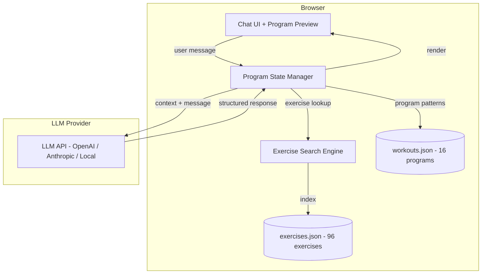
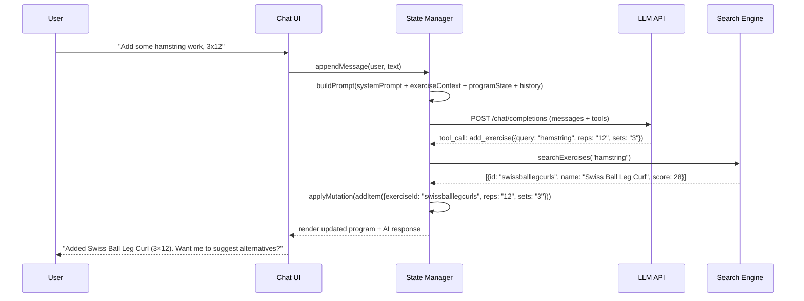
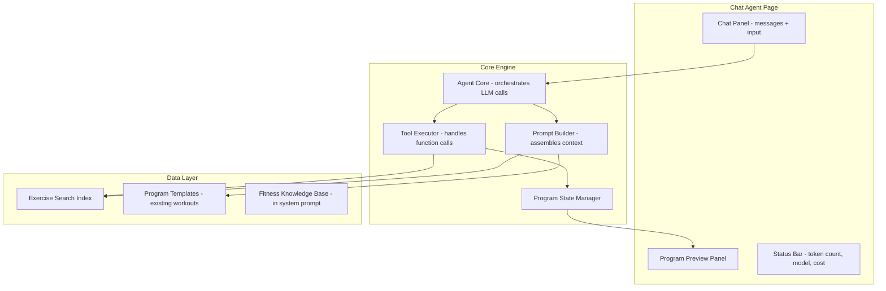
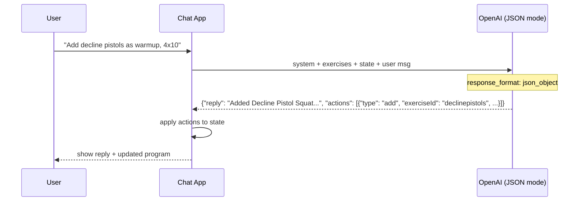
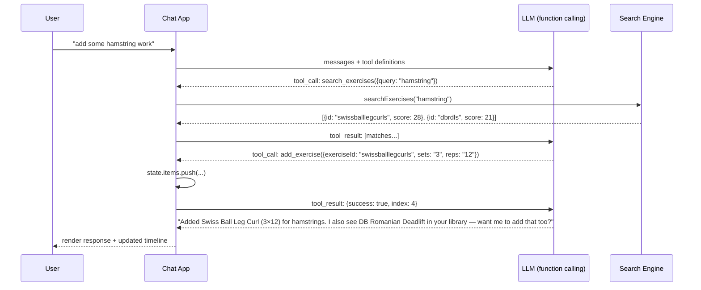
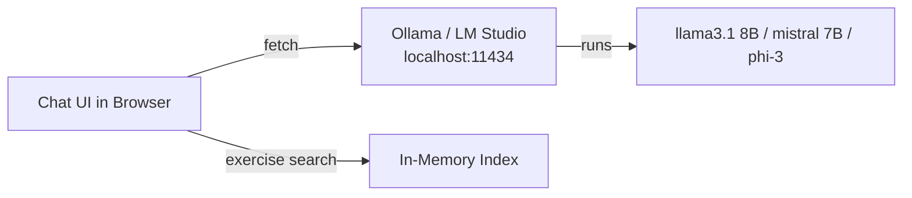
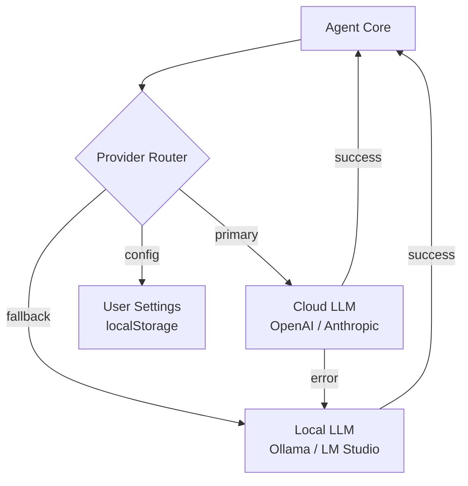
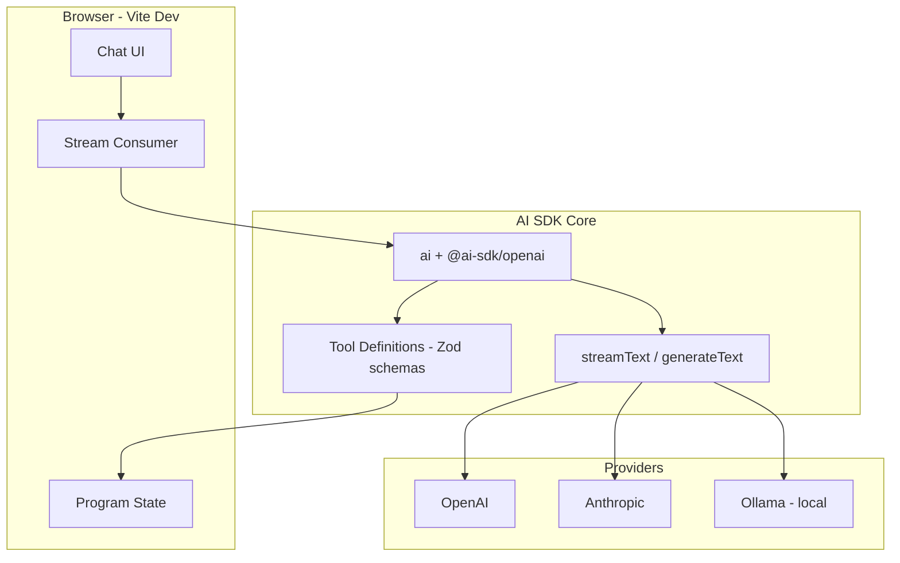
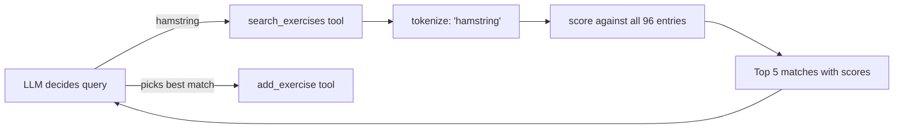
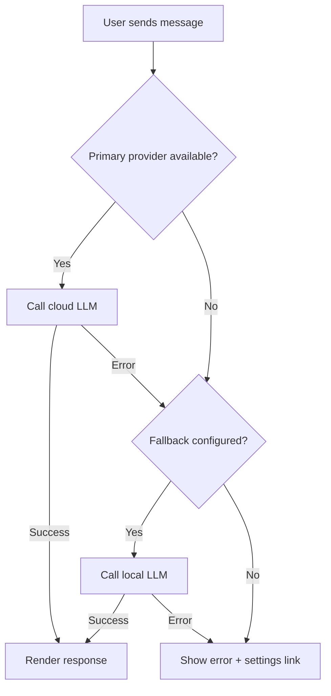

# Design Document: AI Program Chat Agent

## Overview

A conversational AI agent that helps users build workout programs through natural language chat. Unlike the existing Studio (manual form-based authoring) or the `ai-program-builder.js` script (batch text parsing), this is a real-time dialogue where the user and AI collaboratively construct a program — adding exercises, adjusting sets/reps, grouping into supersets, and flagging gaps based on fitness goals.

The agent maintains a running program state, has full knowledge of the 96 exercises in `exercises.json`, understands fitness programming principles (progressive overload, muscle balance, rehab protocols), and can map freeform language ("add some hamstring work", "make it a superset with the previous one") to structured program mutations.

This document explores 5 implementation approaches from minimal to sophisticated, covering architecture, LLM integration, system prompt design, exercise matching, data flow, and migration path.

## Architecture

### High-Level System Diagram




### Core Data Flow



## Components and Interfaces

### Component Architecture




### Interface Definitions

```typescript
// --- Agent Core ---
interface ChatMessage {
  role: 'user' | 'assistant' | 'system' | 'tool';
  content: string;
  toolCalls?: ToolCall[];
  toolCallId?: string;
  timestamp: number;
}

interface ToolCall {
  id: string;
  name: string;
  arguments: Record<string, unknown>;
  result?: unknown;
  status: 'pending' | 'executed' | 'error';
}

interface AgentConfig {
  provider: 'openai' | 'anthropic' | 'ollama' | 'lmstudio' | 'custom';
  model: string;
  apiKey: string;
  baseUrl?: string;          // for local models or proxies
  temperature?: number;      // default 0.3 for structured output
  maxTokens?: number;        // default 2048
  streaming?: boolean;       // default true
}

interface AgentCore {
  config: AgentConfig;
  history: ChatMessage[];
  programState: ProgramState;

  sendMessage(text: string): AsyncGenerator<string>;  // streaming
  reset(): void;
  exportProgram(): ProgramExport;
  setGoal(goal: ProgramGoal): void;
}

// --- Program State ---
interface ProgramState {
  meta: ProgramMeta;
  items: ProgramItem[];       // reuses existing types.ts
  newExercises: Exercise[];   // exercises created during session
  goal?: ProgramGoal;
}

interface ProgramMeta {
  title: string;
  id: string;
  requirements: string;
  description: string;
  difficulty: 'beginner' | 'intermediate' | 'advanced' | null;
  duration: number | null;
  tags: string[];
}

interface ProgramGoal {
  type: 'strength' | 'hypertrophy' | 'rehab' | 'agility' | 'endurance' | 'general';
  targetMuscles?: string[];
  constraints?: string[];     // e.g., "no jumping", "knee-friendly"
  sessionDuration?: number;   // minutes
}

interface ProgramExport {
  program: Program;           // ready for workouts.json
  newExercises: Exercise[];   // ready for exercises.json
}
```


### Tool Definitions (Function Calling Schema)

```typescript
// Tools the LLM can invoke to mutate program state
interface AgentTools {
  // Search existing exercises
  search_exercises(args: {
    query: string;
    limit?: number;           // default 5
    filters?: {
      equipment?: string[];
      tags?: string[];
      muscleGroup?: string;
    };
  }): SearchResult[];

  // Add exercise to program timeline
  add_exercise(args: {
    exerciseId: string;       // from search results
    reps?: string;
    sets?: string;
    repUnits?: string;
    note?: string;
    tags?: ItemTag[];
    position?: number;        // insert at index, default = end
  }): { success: boolean; index: number };

  // Create a new exercise (not in library)
  create_exercise(args: {
    name: string;
    reps?: string;
    sets?: string;
    repUnits?: string;
    note?: string;
    equipment?: string[];
  }): { id: string; name: string };

  // Group exercises into superset/circuit/compound
  group_exercises(args: {
    indices: number[];        // 0-based positions in timeline
    kind: 'superset' | 'compound' | 'circuit';
    note?: string;
  }): { success: boolean };

  // Remove exercise from timeline
  remove_exercise(args: {
    index: number;
  }): { success: boolean };

  // Update exercise parameters
  update_exercise(args: {
    index: number;
    reps?: string;
    sets?: string;
    repUnits?: string;
    note?: string;
    tags?: ItemTag[];
  }): { success: boolean };

  // Reorder exercise
  move_exercise(args: {
    fromIndex: number;
    toIndex: number;
  }): { success: boolean };

  // Set program metadata
  set_metadata(args: {
    title?: string;
    requirements?: string;
    description?: string;
    difficulty?: string;
    duration?: number;
    tags?: string[];
  }): { success: boolean };

  // Analyze current program for gaps
  analyze_program(args: {
    aspect: 'muscle_balance' | 'volume' | 'progression' | 'warmup_cooldown';
  }): { analysis: string; suggestions: string[] };
}
```

## Data Models

### Exercise Search Index (In-Memory)

Reuses the existing `ExercisePicker` tokenize/score engine from `v2/src/components/ExercisePicker.js`:

```typescript
interface SearchEntry {
  id: string;
  name: string;
  tokens: string[];           // tokenized name + aliases + id
  equipment: string[];
  hasDemos: boolean;
  exercise: Exercise;         // full object reference
}

interface SearchResult {
  id: string;
  name: string;
  score: number;
  hasDemos: boolean;
  recommendations?: Exercise['recommendations'];
}
```


### Fitness Knowledge Encoding

The system prompt embeds domain knowledge. The exercise catalog is injected as a compact reference:

```
EXERCISE_CATALOG (96 exercises):
id | name | equipment | default_reps | default_sets | default_units
---
declinepistols | Decline Pistol Squat | bodyweight | 10 | 4 | reps
heeltaps | Heel Taps | bodyweight | 10 | 4 | reps
tkes | TKEs | band | 20 | 4 | reps
dbsquatjumps | DB Squat Jumps | dumbbells | 4 | 6 | reps
...
```

This compact format uses ~3-4KB for 96 exercises (well within context limits).

### Muscle Group Mapping (Derived Knowledge)

```typescript
// Inferred from exercise names/patterns — embedded in system prompt
const MUSCLE_GROUPS: Record<string, string[]> = {
  quads: ['pistols', 'squat', 'lunge', 'leg press', 'step up'],
  hamstrings: ['rdl', 'deadlift', 'leg curl', 'nordic', 'heel dig'],
  glutes: ['bridge', 'hip thrust', 'kickback', 'clamshell'],
  calves: ['calf raise', 'pogo'],
  chest: ['bench press', 'chest fly', 'push up', 'dip'],
  back: ['row', 'pull up', 'lat pulldown', 'back raise'],
  shoulders: ['press', 'lateral raise', 'face pull', 'javelin'],
  core: ['plank', 'crunch', 'pallof', 'dead bug', 'bird dog'],
  arms: ['curl', 'tricep', 'hammer'],
};
```

## Implementation Approaches

---

## Approach 1: Structured Prompt + JSON Mode (Simplest)

**Tagline:** "One API call per message, LLM returns JSON actions directly."

### How It Works

No function calling. The LLM receives the full context (system prompt + exercise list + current program state + conversation history) and returns a JSON object with both a conversational reply and structured mutations.



### Response Schema

```json
{
  "reply": "string — conversational response to user",
  "actions": [
    {
      "type": "add_exercise | remove_exercise | update_exercise | group | set_metadata | suggest",
      "exerciseId": "string",
      "reps": "string",
      "sets": "string",
      "repUnits": "string",
      "note": "string",
      "tags": ["warmup"],
      "position": 0
    }
  ]
}
```


### Tradeoffs

| Aspect | Assessment |
|--------|-----------|
| Complexity | ⭐ Minimal — ~200 lines of core logic |
| Reliability | ⚠️ JSON parsing can fail, needs validation layer |
| Exercise matching | LLM does the matching (may hallucinate IDs) |
| Streaming | ❌ Must wait for full JSON response |
| Cost | ~$0.01-0.03 per message (GPT-4o-mini) |
| Models | OpenAI (json_mode), Anthropic (with prompt engineering) |
| Effort | ~3-4 commits |

### Best For
Quick prototype, proof of concept, testing the UX before investing in tooling infrastructure.

---

## Approach 2: Function Calling / Tool Use (Recommended Starting Point)

**Tagline:** "LLM decides what tools to call, app executes them deterministically."

### How It Works

The LLM receives tool definitions (search_exercises, add_exercise, etc.) and decides which to invoke. The app executes tools locally and feeds results back. This separates "understanding intent" (LLM) from "executing actions" (deterministic code).



### Key Advantages Over Approach 1

1. **Exercise matching is deterministic** — LLM calls `search_exercises`, app uses the proven tokenize/score engine
2. **No hallucinated IDs** — LLM can only add exercises that exist in search results
3. **Streaming works** — conversational text streams while tool calls execute
4. **Multi-step reasoning** — LLM can search, evaluate results, then decide what to add
5. **Auditable** — every mutation is a tool call with clear inputs/outputs

### Provider Support

| Provider | Function Calling | Streaming | Cost (per msg) |
|----------|-----------------|-----------|----------------|
| OpenAI GPT-4o-mini | ✅ Native | ✅ | ~$0.01-0.02 |
| OpenAI GPT-4o | ✅ Native | ✅ | ~$0.03-0.08 |
| Anthropic Claude 3.5 Sonnet | ✅ Native | ✅ | ~$0.02-0.05 |
| Anthropic Claude 3.5 Haiku | ✅ Native | ✅ | ~$0.005-0.01 |
| Ollama (llama3, mistral) | ⚠️ Via grammar | ⚠️ | Free (local) |
| LM Studio | ⚠️ Via grammar | ⚠️ | Free (local) |

### Effort & Complexity

| Aspect | Assessment |
|--------|-----------|
| Complexity | ⭐⭐ Moderate — ~500 lines core + UI |
| Reliability | ✅ High — deterministic tool execution |
| Exercise matching | ✅ Uses proven search engine |
| Streaming | ✅ Text streams, tools execute inline |
| Cost | $0.01-0.05 per message depending on model |
| Effort | ~8-10 commits |

---

## Approach 3: Local LLM with Ollama/LM Studio (Zero Cost)

**Tagline:** "Run the model on your machine. No API keys, no cost, full privacy."

### How It Works

Same architecture as Approach 2, but the LLM runs locally via Ollama or LM Studio. The app hits `http://localhost:11434/api/chat` (Ollama) or `http://localhost:1234/v1/chat/completions` (LM Studio) instead of a cloud API.




### Model Options for Local

| Model | Size | RAM Needed | Quality | Tool Calling |
|-------|------|-----------|---------|--------------|
| Llama 3.1 8B | 4.7GB | 8GB | Good | Via grammar/JSON mode |
| Mistral 7B | 4.1GB | 8GB | Good | Via grammar |
| Phi-3 Mini 3.8B | 2.3GB | 4GB | Decent | Limited |
| Qwen2.5 7B | 4.4GB | 8GB | Good | Native tool calling |
| Llama 3.1 70B | 40GB | 48GB | Excellent | Via grammar |

### Adaptation for Local Models

Since most local models don't support native function calling, use **structured output with JSON grammar**:

```javascript
// Ollama request with format constraint
const response = await fetch('http://localhost:11434/api/chat', {
  method: 'POST',
  body: JSON.stringify({
    model: 'llama3.1',
    messages: [...],
    format: 'json',  // forces JSON output
    options: { temperature: 0.3 }
  })
});
```

The system prompt instructs the model to respond in the Approach 1 JSON schema. The app validates and applies actions.

### Tradeoffs

| Aspect | Assessment |
|--------|-----------|
| Complexity | ⭐⭐ Same as Approach 2 + local model setup |
| Reliability | ⚠️ Smaller models make more mistakes |
| Exercise matching | ✅ Still uses local search engine |
| Streaming | ✅ Ollama streams natively |
| Cost | 🆓 Free (electricity only) |
| Quality | ⚠️ 7-8B models struggle with complex multi-step reasoning |
| Effort | ~10 commits (same code + model config UI) |

### Best For
Privacy-conscious development, offline use, experimentation without API costs. Can be a fallback when API is down.

---

## Approach 4: Hybrid — Cloud LLM + Local Fallback (Best of Both)

**Tagline:** "Use GPT-4o-mini for quality, fall back to Ollama when offline or over budget."

### How It Works

The agent supports multiple providers. User configures their preferred provider in settings. The app tries the primary provider first; if it fails (network error, rate limit, no API key), it falls back to local.



### Provider Configuration UI

```
┌─ AI Settings ─────────────────────────────────┐
│                                                │
│  Provider: [OpenAI ▾]                          │
│  Model:    [gpt-4o-mini ▾]                     │
│  API Key:  [sk-••••••••••••••••]  [Test]       │
│                                                │
│  ☐ Enable local fallback (Ollama)              │
│    URL: [http://localhost:11434]                │
│    Model: [llama3.1 ▾]                         │
│                                                │
│  Budget: [$0.50/session] [Reset]               │
│  Used this session: $0.03                      │
│                                                │
└────────────────────────────────────────────────┘
```

### Tradeoffs

| Aspect | Assessment |
|--------|-----------|
| Complexity | ⭐⭐⭐ Provider abstraction layer |
| Reliability | ✅✅ Redundant — always has a fallback |
| Quality | ✅ Cloud for complex, local for simple |
| Cost | Configurable — user controls budget |
| Effort | ~12-14 commits |

---

## Approach 5: Vercel AI SDK + Edge Functions (Production-Ready)

**Tagline:** "Framework-grade streaming, provider switching, and structured output — ready to ship."

### How It Works

Uses the [Vercel AI SDK](https://sdk.vercel.ai/) (`ai` npm package) which provides:
- Unified API across OpenAI, Anthropic, Google, Ollama
- Built-in streaming with React/vanilla hooks
- Structured output with Zod schemas
- Tool calling with automatic execution
- Token counting and cost tracking

Since the project is vanilla JS (no React), we use the **core** package directly:

```javascript
import { generateText, streamText, tool } from 'ai';
import { openai } from '@ai-sdk/openai';
import { anthropic } from '@ai-sdk/anthropic';
import { ollama } from 'ollama-ai-provider';
import { z } from 'zod';

const result = await streamText({
  model: openai('gpt-4o-mini'),
  system: SYSTEM_PROMPT,
  messages: history,
  tools: {
    searchExercises: tool({
      description: 'Search the exercise library',
      parameters: z.object({ query: z.string(), limit: z.number().optional() }),
      execute: async ({ query, limit }) => searchExercises(query, limit),
    }),
    addExercise: tool({
      description: 'Add an exercise to the program timeline',
      parameters: z.object({
        exerciseId: z.string(),
        reps: z.string().optional(),
        sets: z.string().optional(),
        repUnits: z.string().optional(),
        note: z.string().optional(),
        tags: z.array(z.string()).optional(),
      }),
      execute: async (args) => stateManager.addItem(args),
    }),
    // ... more tools
  },
  maxSteps: 5,  // allow multi-step tool use
});
```


### Architecture with Vercel AI SDK



### Why This Approach

- **No backend needed** — AI SDK core runs in browser (or Node for local dev)
- **Provider switching** — change one line to swap OpenAI ↔ Anthropic ↔ Ollama
- **Structured output** — Zod schemas validate tool arguments at runtime
- **Streaming built-in** — handles SSE parsing, partial JSON, etc.
- **Multi-step** — `maxSteps` allows the LLM to search → evaluate → add in one turn
- **Active ecosystem** — well-maintained, TypeScript-first, good docs

### Tradeoffs

| Aspect | Assessment |
|--------|-----------|
| Complexity | ⭐⭐⭐ Framework to learn, but handles hard problems |
| Reliability | ✅✅ Battle-tested streaming + validation |
| Dependencies | `ai`, `@ai-sdk/openai`, `zod` (~50KB total) |
| Streaming | ✅✅ First-class support |
| Provider flexibility | ✅✅ Swap providers with one line |
| Cost | Same as cloud providers |
| Effort | ~10-12 commits |
| Migration | Easy — SDK works in browser, Node, or edge |

### Best For
Production-quality implementation that handles edge cases (streaming errors, partial responses, tool validation) without reinventing the wheel.

---

## Comparison Matrix

| | Approach 1 | Approach 2 | Approach 3 | Approach 4 | Approach 5 |
|---|---|---|---|---|---|
| **Name** | JSON Mode | Function Calling | Local LLM | Hybrid | Vercel AI SDK |
| **Effort** | 3-4 commits | 8-10 commits | 10 commits | 12-14 commits | 10-12 commits |
| **Dependencies** | None (fetch) | None (fetch) | Ollama installed | None (fetch) | ai, zod (~50KB) |
| **Cost/msg** | $0.01-0.03 | $0.01-0.05 | Free | Configurable | $0.01-0.05 |
| **Streaming** | ❌ | ✅ | ✅ | ✅ | ✅✅ |
| **Exercise match** | LLM guesses | Deterministic | Deterministic | Deterministic | Deterministic |
| **Reliability** | ⚠️ | ✅ | ⚠️ | ✅✅ | ✅✅ |
| **Offline** | ❌ | ❌ | ✅ | ✅ (fallback) | ✅ (with Ollama) |
| **Multi-provider** | Manual | Manual | N/A | ✅ | ✅✅ |
| **Best for** | Prototype | MVP | Privacy/free | Resilience | Production |

### Recommended Path

**Start with Approach 2 (Function Calling)** as a standalone local dev tool, then migrate to **Approach 5 (Vercel AI SDK)** when embedding into the Action App. Approach 2 teaches the core patterns with minimal dependencies; Approach 5 handles production concerns (streaming edge cases, provider switching, validation).

---

## System Prompt Design

### Core System Prompt

```
You are a fitness programming assistant for the Action App. You help users build workout programs through conversation.

## Your Capabilities
- Search the exercise library (96 exercises) using the search_exercises tool
- Add exercises to the program timeline
- Create new exercises when nothing in the library matches
- Group exercises into supersets, compounds, or circuits
- Set program metadata (title, requirements, difficulty)
- Analyze programs for muscle balance, volume, and progression gaps

## Rules
1. ALWAYS search before adding — never guess exercise IDs
2. Use the user's exact reps/sets if specified; otherwise use exercise defaults
3. When the user says "make it a superset with the previous one", group the last-added exercise with the one before it
4. Tag warmup exercises with ["warmup"] and cooldown/stretches with ["stretch"]
5. If the user's request is ambiguous, ask a clarifying question
6. After adding exercises, briefly confirm what was added and offer suggestions
7. When creating new exercises, derive a kebab-case ID from the name

## Fitness Knowledge
- A balanced lower body session hits: quads, hamstrings, glutes, calves
- A balanced upper body session hits: chest, back, shoulders, arms (biceps + triceps)
- Warmups should be 2-4 exercises, low intensity, movement-specific
- Typical rep ranges: strength (3-6), hypertrophy (8-12), endurance (15-20), rehab (12-20 slow)
- Supersets pair opposing muscles (e.g., chest + back) or same muscle for intensity
- Progressive overload: increase weight, reps, or sets over time
- Rehab programs: higher reps, slower tempo, isometric holds, avoid impact

## Program Goals
When the user states a goal, adjust your suggestions:
- Strength: compound movements, 3-6 reps, longer rest
- Hypertrophy: moderate weight, 8-12 reps, supersets welcome
- Rehab: controlled movements, isometrics, no jumping, knee-friendly alternatives
- Agility: explosive movements, plyometrics, shorter rest
- Endurance: higher reps (15-20), circuits, minimal rest

## Current Exercise Library
{EXERCISE_CATALOG}

## Current Program State
{PROGRAM_STATE_JSON}
```


### Context Window Budget

| Section | Tokens (approx) | Notes |
|---------|-----------------|-------|
| System prompt (instructions) | ~800 | Static |
| Exercise catalog (96 exercises) | ~1,500 | Compact pipe-delimited format |
| Current program state | ~200-800 | Grows as program builds |
| Conversation history | ~500-3,000 | Last 10-20 messages |
| Tool definitions | ~600 | 8 tools with schemas |
| **Total per request** | **~3,600-6,700** | Well within 128K context |

### Exercise Catalog Format (Injected into System Prompt)

```
EXERCISES (96 total, format: id | name | equipment):
1a-db-row | 1A DB Row | dumbbells
1l-rdl-w-band-above-knee | 1L RDL w/ Band Above Knee | band
2l-pogo | 2L Pogo | bodyweight
45degreebackraises | 45° Back Raise | bench
bandedclamshells | Banded Clamshells | band
boxpistols | Box Pistol Squat | box
calfraises | Calf Raise | bodyweight
chestflies | Chest Fly | dumbbells
dbboxsquats | DB Box Squat | dumbbells, box
dbrdls | DB Romanian Deadlift | dumbbells
dbsquatjumps | DB Squat Jumps | dumbbells
declinepistols | Decline Pistol Squat | bodyweight
...
```

---

## Exercise Matching Strategy

### How the Agent Finds Exercises

The agent does NOT match exercises itself. It calls `search_exercises` which runs the proven tokenize/score algorithm from `ExercisePicker.js`:



### Matching Examples

| User says | LLM searches for | Top match | Score |
|-----------|------------------|-----------|-------|
| "add some hamstring work" | "hamstring" | swissballlegcurls (Swiss Ball Leg Curl) | 28 |
| "throw in decline pistols" | "decline pistols" | declinepistols | 20 |
| "add a Romanian deadlift" | "Romanian deadlift" | dbrdls (DB Romanian Deadlift) | 17 |
| "add calf raises" | "calf raises" | calfraises (Calf Raise) | 17 |
| "add backward treadmill walk" | "backward treadmill walk" | ❌ No match | 0 |

When no match is found, the LLM uses `create_exercise` to make a new entry.

### Disambiguation

When multiple exercises match similarly (e.g., "deadlift" matches both `dbrdls` and `trapbardeadlift`), the LLM presents options to the user:

```
I found a few deadlift variations in your library:
1. DB Romanian Deadlift (dbrdls)
2. Trap Bar Deadlift (trapbardeadlift)
3. Single-Leg DB Romanian Deadlift (sldbrdl)

Which one did you have in mind? Or should I add a different variation?
```

---

## Chat UI Design

### Layout (Local Dev Tool — Single Panel)

```
┌─────────────────────────────────────────────────────────────┐
│  🏋️ AI Program Builder                    [⚙️ Settings]     │
├─────────────────────────────────────────────────────────────┤
│                                                             │
│  ┌─ Program: Lower Body Rebuild A ──────────────────────┐  │
│  │  Requirements: Dumbbells, Treadmill                   │  │
│  │  Goal: Rehab (knee-friendly)                          │  │
│  │                                                       │  │
│  │  1. 🟡 Backward Treadmill Walk — 5 min [warmup]      │  │
│  │  2. 🟡 Hamstring Heel Dig — 30 secs × 3 sets         │  │
│  │  3. ── Glute Bridge — 12 reps × 3 sets               │  │
│  │  4. ── DB Romanian Deadlift — 10 reps × 3 sets       │  │
│  │  5. ── DB Box Squat — 10 reps × 3 sets               │  │
│  │                                                       │  │
│  │  [Export JSON]  [Copy to Clipboard]                   │  │
│  └───────────────────────────────────────────────────────┘  │
│                                                             │
│  ┌─ Chat ────────────────────────────────────────────────┐  │
│  │  🤖 I've started a rehab-focused lower body program.  │  │
│  │     What exercises would you like to add?             │  │
│  │                                                       │  │
│  │  You: add backward treadmill walk, 5 min, as warmup   │  │
│  │                                                       │  │
│  │  🤖 I don't have "Backward Treadmill Walk" in the     │  │
│  │     library. I'll create it as a new exercise.        │  │
│  │     ✓ Created: backward-treadmill-walk                │  │
│  │     ✓ Added to position 1 [warmup]                    │  │
│  │                                                       │  │
│  │  You: now add hamstring heel dig isometric, 30 secs   │  │
│  │       3 sets                                          │  │
│  │                                                       │  │
│  │  🤖 Created and added Hamstring Heel Dig Isometric    │  │
│  │     (30 secs × 3 sets). Good choice for knee rehab!  │  │
│  │                                                       │  │
│  └───────────────────────────────────────────────────────┘  │
│                                                             │
│  ┌──────────────────────────────────────────────────────┐   │
│  │ Type a message...                          [Send ➤]  │   │
│  └──────────────────────────────────────────────────────┘   │
└─────────────────────────────────────────────────────────────┘
```


### Layout (Embedded in Action App — Split Panel)

```
┌────────────────────────────────────────────────────────────────────────┐
│  /#/studio/ai                                          [⚙️] [Export]   │
├──────────────────────────────┬─────────────────────────────────────────┤
│  Chat                        │  Program Preview                        │
│                              │                                         │
│  🤖 What kind of program     │  Title: _______________                 │
│  are you building today?     │  Goal: [Rehab ▾]                        │
│                              │  Requirements: ___________              │
│  You: I need a knee-friendly │                                         │
│  lower body session, about   │  ┌─────────────────────────────────┐   │
│  45 minutes, using dumbbells │  │ 1. Backward Treadmill Walk      │   │
│  and a treadmill             │  │    5 min · 1 set · [warmup]     │   │
│                              │  ├─────────────────────────────────┤   │
│  🤖 Great! I'll build a      │  │ 2. Hamstring Heel Dig           │   │
│  rehab-focused lower body    │  │    30 secs · 3 sets             │   │
│  session. Let me start with  │  ├─────────────────────────────────┤   │
│  some warmup exercises...    │  │ 3. Glute Bridge                 │   │
│                              │  │    12 reps · 3 sets             │   │
│  [Searching exercises...]    │  ├─────────────────────────────────┤   │
│  [Added: Decline Pistol]     │  │ 4. DB Romanian Deadlift         │   │
│  [Added: Heel Taps]          │  │    10 reps · 3 sets             │   │
│                              │  └─────────────────────────────────┘   │
│  🤖 I've added 2 warmup      │                                         │
│  exercises. Now for the main │  Exercises: 4 | Est. duration: ~35 min  │
│  work — what muscle groups   │                                         │
│  do you want to focus on?    │  [Export JSON] [Open in Studio Editor]  │
│                              │                                         │
│  ┌────────────────────────┐  │                                         │
│  │ Type a message... [➤]  │  │                                         │
│  └────────────────────────┘  │                                         │
└──────────────────────────────┴─────────────────────────────────────────┘
```

---

## Migration Path: Local Tool → Action App

### Phase 1: Standalone Local Tool (Week 1-2)

```
scripts/
  ai-chat-agent/
    index.html          ← standalone HTML page
    agent.js            ← AgentCore + tools
    state.js            ← ProgramState manager
    ui.js               ← Chat UI rendering
    config.js           ← Provider settings
    style.css           ← Minimal styling
```

- Runs via `npx serve scripts/ai-chat-agent/` or Vite
- Loads exercises.json directly
- Exports JSON to clipboard
- No integration with v2 app yet

### Phase 2: Integrate into Action App (Week 3-4)

```
v2/src/
  pages/
    AIChatPage.js       ← new route /#/studio/ai
  components/
    ChatPanel.js        ← message list + input
    ProgramPreview.js   ← live program state display
    AgentSettings.js    ← provider config modal
  utils/
    agent.js            ← AgentCore (moved from standalone)
    agentTools.js       ← tool definitions + executors
    agentPrompt.js      ← system prompt builder
```

- New route: `/#/studio/ai` (dev-only, same gate as Studio)
- Reuses existing `ExercisePicker` search engine
- Reuses existing `data.js` loaders
- Program preview reuses `ProgramDetailPage` components
- Export feeds into existing Studio export flow

### Phase 3: Polish & Production (Week 5+)

- Add to production (behind feature flag or user opt-in)
- Persist chat sessions in localStorage
- Add "Open in Studio Editor" button (transfers state to ProgramEditorPage)
- Add conversation templates ("Build me a push day", "Create a rehab program")
- Token/cost tracking in status bar

### Migration Diagram

```mermaid
graph LR
    subgraph Phase 1 - Standalone
        SA[scripts/ai-chat-agent/]
        SA -->|loads| EJ[exercises.json]
        SA -->|exports| Clipboard[JSON to clipboard]
    end

    subgraph Phase 2 - Integrated
        Route[/#/studio/ai]
        Route -->|reuses| EP[ExercisePicker search]
        Route -->|reuses| Data[data.js loaders]
        Route -->|exports to| Studio[Studio Editor]
    end

    subgraph Phase 3 - Production
        Prod[/#/ai-builder]
        Prod -->|feature flag| Users[All users]
        Prod -->|persists| LS[localStorage sessions]
    end

    SA -.->|move agent.js| Route
    Route -.->|remove dev gate| Prod
```

---

## Error Handling

### Error Scenarios

| Scenario | Detection | Response | Recovery |
|----------|-----------|----------|----------|
| API key missing/invalid | 401 response | Show settings modal | User enters valid key |
| Rate limit hit | 429 response | "Rate limited, waiting..." | Auto-retry after delay |
| Network offline | fetch throws | "You're offline. Switch to local model?" | Offer Ollama fallback |
| LLM returns invalid JSON | JSON.parse fails | Retry once with "Please respond in valid JSON" | Fall back to text-only response |
| Tool call with bad args | Zod validation fails | Log error, ask LLM to retry | LLM self-corrects |
| Exercise ID not found | search returns empty | LLM offers to create new | create_exercise tool |
| Context too long | Token count > limit | Trim oldest messages | Keep system prompt + last 10 messages |
| Ollama not running | Connection refused | "Ollama isn't running. Start it with `ollama serve`" | Show instructions |

### Graceful Degradation



---

## Testing Strategy

### Unit Testing

- **Tool executors**: Given state + tool args → verify state mutation
- **Search integration**: Given query → verify correct exercise matches
- **Prompt builder**: Given state + history → verify token count within budget
- **State manager**: Given sequence of mutations → verify final program JSON

### Integration Testing

- **Full conversation flow**: Simulate multi-turn conversation, verify program output
- **Provider switching**: Verify same tools work across OpenAI/Anthropic/Ollama
- **Export validation**: Verify exported JSON matches workouts.json schema

### Manual Testing Scenarios

1. Build a complete program from scratch via chat
2. Paste a ChatGPT workout dump and have agent parse it
3. Ask agent to analyze a program for gaps
4. Create exercises that don't exist in the library
5. Group exercises into supersets via natural language
6. Switch providers mid-session (state should persist)

---

## Performance Considerations

- **First message latency**: ~1-3s (cloud) or ~3-8s (local 7B model)
- **Streaming**: Tokens appear in ~100ms chunks, feels responsive
- **Exercise search**: <5ms (96 entries, in-memory index)
- **State updates**: Instant (in-memory, reactive rendering)
- **Context growth**: ~50 tokens per message pair; at 20 messages, still only ~1,000 tokens of history
- **Memory**: Exercise index + state + history < 1MB total

### Optimization Strategies

- Compact exercise catalog format (pipe-delimited, not full JSON)
- Trim conversation history to last 15 messages (keep system prompt fresh)
- Cache search results for repeated queries within a session
- Debounce UI re-renders on streaming (batch every 50ms)

---

## Security Considerations

- **API keys**: Stored in localStorage, never sent to any server except the LLM provider
- **No backend**: All processing is client-side; no data leaves the browser except LLM API calls
- **Key exposure**: Since this is a dev tool (localhost only in Phase 1-2), key exposure risk is minimal
- **Production**: If exposed to users, consider a thin proxy that holds the key server-side
- **Input sanitization**: User messages are passed to LLM as-is (no injection risk since LLM is the consumer)
- **Output sanitization**: LLM responses rendered as text (not innerHTML) to prevent XSS

---

## Dependencies

### Phase 1 (Standalone)
- None beyond `fetch` API (works in any modern browser)
- exercises.json loaded via fetch or import

### Phase 2 (Integrated into Action App)
- Existing: Vite, Tailwind CSS 4
- New (optional): `ai` + `@ai-sdk/openai` + `zod` if using Approach 5

### Phase 3 (Production)
- Same as Phase 2
- Optional: `@ai-sdk/anthropic`, `ollama-ai-provider` for multi-provider

### External Services
- OpenAI API (GPT-4o-mini recommended for cost/quality balance)
- Anthropic API (Claude 3.5 Haiku for budget, Sonnet for quality)
- Ollama (local, free, requires installation)

---

## Cost Estimates

| Usage Pattern | Model | Cost/Session | Cost/Month (daily use) |
|---------------|-------|-------------|----------------------|
| Light (5 messages) | GPT-4o-mini | $0.05-0.10 | $1.50-3.00 |
| Medium (15 messages) | GPT-4o-mini | $0.15-0.30 | $4.50-9.00 |
| Heavy (30 messages) | GPT-4o-mini | $0.30-0.60 | $9.00-18.00 |
| Light (5 messages) | Claude 3.5 Haiku | $0.03-0.05 | $0.90-1.50 |
| Any | Ollama (local) | $0.00 | $0.00 |

GPT-4o-mini is the sweet spot: smart enough for function calling, cheap enough for daily use.

---

## Correctness Properties

### Property 1: Exercise ID Integrity
Every `exerciseId` in the exported program MUST exist in either `exercises.json` or the `newExercises[]` array — no orphan references.

### Property 2: Search-Before-Add Invariant
The agent MUST call `search_exercises` before calling `add_exercise` with an existing ID — prevents hallucinated exercise IDs.

### Property 3: State Consistency
After any tool execution, `programState.items.length` equals the count of all add operations minus all remove operations.

### Property 4: Group Validity
Every group item has `exercises.length >= 2` — you can't have a superset of one.

### Property 5: ID Derivation Determinism
`create_exercise({name: "Backward Treadmill Walk"})` always produces `id: "backward-treadmill-walk"` — kebab-case, no randomness.

### Property 6: Export Schema Compliance
`exportProgram()` output validates against the existing `Program` type in `types.ts` — the exported JSON is paste-ready for `workouts.json`.

### Property 7: Idempotent Tool Execution
Calling `update_exercise({index: 2, reps: "10"})` twice produces the same state as calling it once.

### Property 8: Context Budget
Total prompt tokens never exceed the model's context window — history is trimmed from the oldest messages first, system prompt is never truncated.
