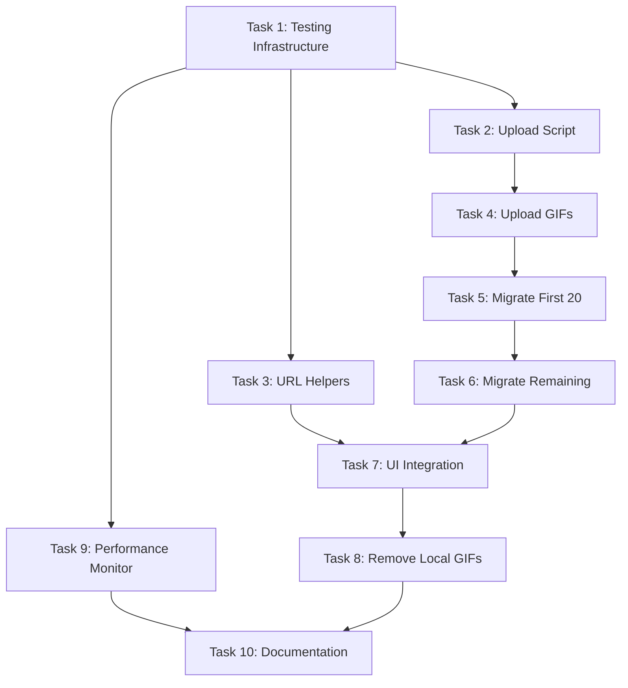

# Implementation Plan: Cloudinary Migration

## Overview

This implementation plan breaks down the Cloudinary migration into 10 tasks following the 150-150-CR commit discipline. Total estimated effort is 16.5 hours across 8 commits.

## Tasks

- [ ] 1. Set up Vitest testing infrastructure (2h) - Commit 0
- [ ] 2. Create Cloudinary upload script with error handling (3h) - Commit 1
- [ ] 3. Create image URL helper functions with transformations (2h) - Commit 2
- [ ] 4. Upload all 82 GIFs to Cloudinary CDN (1h) - Commit 3
- [ ] 5. Migrate first 20 exercises to Cloudinary URLs (1h) - Commit 4
- [ ] 6. Migrate remaining 62 exercises to Cloudinary URLs (1h) - Commit 5
- [ ] 7. Integrate UI with lazy loading and error handling (3h) - Commit 6
- [ ] 8. Remove local GIF files from repository (0.5h) - Commit 7
- [ ] 9. Add performance monitoring module (2h) - Commit 8
- [ ] 10. Update project documentation (1h) - Documentation commit


## Task Dependency Graph

```json
{
  "waves": [
    {
      "name": "Wave 1: Foundation",
      "tasks": [1],
      "description": "Set up testing infrastructure"
    },
    {
      "name": "Wave 2: Core Modules",
      "tasks": [2, 3, 9],
      "description": "Create upload script, URL helpers, and performance monitor (parallel)"
    },
    {
      "name": "Wave 3: Migration",
      "tasks": [4, 5, 6],
      "description": "Upload GIFs and migrate JSON references (sequential)"
    },
    {
      "name": "Wave 4: Integration",
      "tasks": [7],
      "description": "Integrate UI with lazy loading and error handling"
    },
    {
      "name": "Wave 5: Cleanup",
      "tasks": [8, 10],
      "description": "Remove local GIFs and update documentation"
    }
  ]
}
```



## Notes

### Critical Path
Task 1 → Task 2 → Task 4 → Task 5 → Task 6 → Task 7 → Task 8

### Parallel Work Opportunities
- Task 3 (URL Helpers) can be developed in parallel with Task 2 (Upload Script)
- Task 9 (Performance Monitor) can be started after Task 1

### Risk Mitigation
- **Task 5**: Deploy and verify in production before proceeding to Task 6
- **Task 8**: Backup gifs/ directory before deletion (point of no return)
- **All tasks**: Follow 150-150-CR rule (max 300 lines per commit)

### Commit Discipline
Each task maps to a specific commit:
- Commits 0-8: Implementation tasks
- Each commit ≤300 lines (150 source, 150 test)
- Each commit independently deployable
- Clear commit messages following convention

