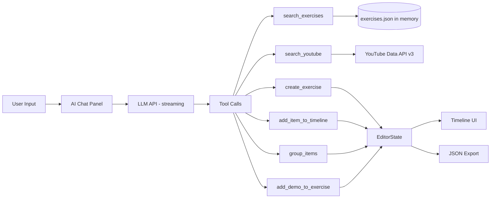
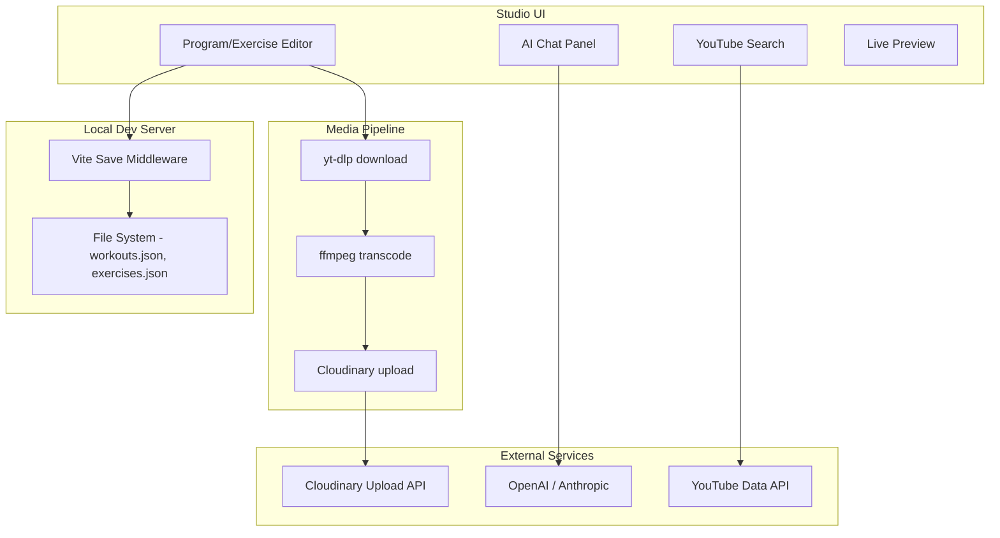

# Program Studio — Design Document

## Overview

A "Create" UI inside the v2 webapp for authoring new **programs** and **exercises** without hand-editing JSON. The Studio writes to two files only: `workouts.json` (programs) and `exercises.json` (canonical exercises). Plan placement (`plans.json`) is a separate concern handled outside the Studio.

## Architecture

The Studio lives at `/#/studio` as a new route. The home page gets a "Create" button (not "Create program" — it's the entry point for both programs and exercises). Inside, the user picks what they're creating:

- **New Program** — search/pick exercises, arrange timeline, set overrides, export
- **New Exercise** — name, demos, recommendations, export

Both share the same data layer (`utils/data.js`), design system, and export mechanism. Five design paths are explored below from low to high complexity. All share the same `EditorState` model; they differ in interaction and infrastructure.

## Components and Interfaces

Key components (Path 3 / recommended):

- **StudioPage** — route handler, shows "What are you creating?" chooser
- **ProgramEditor** — owns program EditorState, renders metadata form + timeline
- **ExerciseEditor** — standalone exercise creation (name, demos, recommendations)
- **ExercisePicker** — fuzzy search over exercises.json with alias matching
- **TimelineList** — ordered items (singles + groups), drag-to-reorder
- **ItemEditor** — inline reps/sets/repUnits/note/displayName/tags per item
- **GroupWrapper** — visual container for superset/compound/circuit
- **DemoManager** — add multiple demos, each with a media-type dropdown that shows contextual fields
- **YouTubeSearchViewport** — (stretch) embedded search panel for finding YouTube demos
- **PreviewPanel** — renders program using existing ProgramDetailPage components
- **ExportDrawer** — generated JSON for `workouts.json` and/or `exercises.json`, copy/download

---

## User Stories

### Story A: Program from all-existing exercises (no new exercises needed)

**Scenario:** Juan wants to add "PPL Push Day 2" — a variation of Push Day 1 using exercises that already exist in the library.

1. Juan clicks **"Create"** on the home page → lands on `/#/studio`.
2. Picks **"New Program"**.
3. Fills metadata: Title = "PPL 3-Day Rotation: Push Day 2", Requirements = "Barbells, Bench, Dumbbells".
4. Opens the exercise picker. Types "yoga push" → finds `yogapushup`. Adds it. Sets tags=["warmup"], reps="10", sets="4".
5. Types "javelin" → finds `javelinstretch`. Adds it. Tags=["warmup"].
6. Types "chest fly" → finds `chestflies` ("Chest Fly"). Adds it.
7. Types "flat bench" → finds `flatbenchpress`. Adds it.
8. Selects items 3 and 4, clicks **"Group → Superset"**. Sets displayName = "Exercise 1: Chest Fly & Flat Bench Press".
9. Continues adding 3 more exercises from the library.
10. Clicks **"Preview"** — sees the program rendered with expanding cards.
11. Clicks **"Export"** — gets the program JSON object. Copies it, pastes into `workouts.json`, commits.

**Key point:** Zero new exercises created. The entire flow is search → pick → arrange → export.

### Story B: Program with new exercises (mixed existing + new)

**Scenario:** Juan has a ChatGPT-generated "Lower Body Rebuild A" workout. Some exercises exist, some are brand new.

1. Juan clicks **"Create"** → picks **"New Program"**.
2. Fills metadata: Title = "Lower Body Rebuild A", Requirements = "Dumbbells, Treadmill, Bench".
3. Types "backward treadmill" in the picker → **no match**.
4. Clicks **"+ Create new exercise"** (inline, without leaving the Studio).
5. In the exercise creation panel:
   - Name: "Backward Treadmill Walk" → id auto-derives to `backward-treadmill-walk`
   - Clicks **"+ Add demo"**
   - Selects media type dropdown: **YouTube**
   - Fields appear: URL input, Start time, End time
   - Pastes `https://youtube.com/shorts/abc123` → thumbnail preview loads
   - Marks as primary ✓
   - Clicks **"+ Add demo"** again for a second source
   - Selects media type: **URL (external)**
   - Pastes a different link
   - Saves the exercise
6. The new exercise appears in the picker. Adds it to position 1, sets reps="5", repUnits="min", tags=["warmup"].
7. Types "glute bridge" → no match. Creates new (same flow as step 5).
8. Types "DB Romanian" → finds `dbrdls` ("DB Romanian Deadlift"). Picks it.
9. Types "box squat" → finds `dbboxsquats` ("DB Box Squat"). Picks it, overrides displayName.
10. Types "calf" → finds `calfraises` ("Calf Raise"). Picks it.
11. Types "single leg" → finds `sldbrdl` ("Single-Leg DB Romanian Deadlift"). Picks it.
12. Types "posture" → finds `posture-ex1` ("Posture Drill"). Picks it, tags=["cooldown"].
13. Clicks **"Export"** → gets TWO outputs:
    - New exercises JSON (to append to `exercises.json`)
    - Program JSON (to append to `workouts.json`)
14. Copies each, pastes, commits.

**Key point:** The Studio handles both existing-exercise-only AND mixed workflows seamlessly. The exercise creation is inline but non-blocking — you create it, it's immediately available in the picker, and it's queued for export.

---

## Five Design Paths

### Path 1: Form-Based Authoring

**Tagline:** "Guided forms, move-up/move-down buttons, clipboard export."

| Aspect | Detail |
|--------|--------|
| Target user | Solo dev who adds 1-2 programs/month |
| Interaction | Step-by-step: metadata form → add items one by one via picker → edit each item inline → preview → export |
| Capabilities | Search exercises, create new (with multi-demo + type dropdown), set overrides, group items, export JSON |
| Cannot do | Drag reorder (uses ▲/▼ buttons), no AI, no YouTube search |
| Data flow | In-memory state → "Copy JSON" / "Download .json" buttons |
| Infrastructure | Static only (runs on GitHub Pages) |
| Effort | ~6 commits |
| Gains | Ships fast, zero dependencies, works anywhere |
| Loses | Reordering is tedious for long programs, no visual timeline feel |

```
┌─────────────────────────────────────────┐
│  /#/studio → New Program                │
├─────────────────────────────────────────┤
│  Program Metadata                       │
│  ┌─────────────────────────────────┐    │
│  │ Title: [Lower Body Rebuild A  ] │    │
│  │ ID:     lower_rebuild_a (auto)  │    │
│  │ Reqs:  [Dumbbells, Treadmill  ] │    │
│  └─────────────────────────────────┘    │
│                                         │
│  Exercise Timeline                      │
│  ┌─ 1. Backward Treadmill Walk ────┐   │
│  │   5 min · 1 set · [warmup]      │   │
│  │   [Edit] [Remove] [▲] [▼]       │   │
│  └──────────────────────────────────┘   │
│  ┌─ 2. Glute Bridge ───────────────┐   │
│  │   12 reps · 3 sets              │   │
│  │   [Edit] [Remove] [▲] [▼]       │   │
│  └──────────────────────────────────┘   │
│  ...                                    │
│                                         │
│  [+ Add Exercise]  [+ Add Group]        │
│                                         │
│  [Preview]  [Export]                    │
└─────────────────────────────────────────┘
```

### Path 2: Drag-and-Drop Timeline Editor

**Tagline:** "Visual timeline with touch-friendly drag reordering and drop-to-group."

| Aspect | Detail |
|--------|--------|
| Target user | Solo dev, mobile-first mindset |
| Interaction | Left panel = exercise picker (search + scroll). Main = sortable timeline. Drag from picker to timeline, drag within to reorder. Drop one card onto another to create a group. |
| Capabilities | Everything in Path 1 + drag reorder + visual grouping + live preview toggle |
| Cannot do | Inline exercise creation with demos, AI, YouTube search |
| Data flow | Same as Path 1 (clipboard/download export) |
| Infrastructure | Static only. Adds SortableJS (~8KB) or native HTML5 DnD |
| Effort | ~9 commits |
| Gains | Much faster reordering, feels like a real editor, grouping is intuitive |
| Loses | Still no demo management for new exercises, still clipboard export |

```
┌──────────────────────────────────────────────────────┐
│  /#/studio → New Program                             │
├────────────────────┬─────────────────────────────────┤
│  Exercise Picker   │  Program Timeline               │
│  ┌──────────────┐  │                                 │
│  │🔍 Search...  │  │  Title: Lower Body Rebuild A    │
│  └──────────────┘  │  Reqs: Dumbbells, Treadmill     │
│                    │                                 │
│  ⠿ Barbell Squat   │  1. ═══ Backward Treadmill ═══ │
│  ⠿ Box Jump        │     5 min · 1 set [warmup]     │
│  ⠿ Calf Raise      │                                 │
│  ⠿ Cat/Camel       │  2. ═══ Glute Bridge ═════════ │
│  ⠿ DB Box Squat    │     12 reps · 3 sets           │
│  ⠿ DB Romanian…    │                                 │
│  ...               │  3. ┌─ SUPERSET ─────────────┐ │
│                    │     │ DB Romanian Deadlift    │ │
│  [+ New Exercise]  │     │ Box Squat to Bench      │ │
│                    │     └────────────────────────┘ │
│                    │                                 │
│                    │  [Preview]  [Export]             │
└────────────────────┴─────────────────────────────────┘
```

### Path 3: Timeline + Inline Exercise Creation + Multi-Demo Management

**Tagline:** "Complete authoring loop — create exercises with typed demos without leaving the editor."

| Aspect | Detail |
|--------|--------|
| Target user | Solo dev, wants self-contained workflow |
| Interaction | Path 2 + slide-over panel for new exercises with full demo management (media type dropdown, multiple sources, thumbnail previews) |
| Capabilities | Everything in Path 2 + create canonical exercises inline + multi-demo with type-specific fields + URL validation + YouTube thumbnail preview |
| Cannot do | AI assist, automated YouTube search |
| Data flow | Export includes both new exercises AND program JSON. Optional: "Download .json" per file |
| Infrastructure | Static only |
| Effort | ~12 commits |
| Gains | Never leave the Studio. Complete loop for both Story A and Story B. |
| Loses | Still manual demo sourcing (you find URLs yourself), no AI |

```
┌──────────────────────────────────────────────────────────────┐
│  New Exercise (slide-over)                                   │
├──────────────────────────────────────────────────────────────┤
│  Name: [Backward Treadmill Walk          ]                   │
│  ID:    backward-treadmill-walk (auto)                       │
│                                                              │
│  Default Recommendations (optional)                          │
│  Reps: [5]  Sets: [1]  Units: [min ▾]                       │
│  Note: [Incline 3, slow pace               ]                │
│                                                              │
│  Demo Sources                                                │
│  ┌────────────────────────────────────────────────────────┐  │
│  │ Demo 1                                                 │  │
│  │ Type: [YouTube        ▾]                               │  │
│  │ URL:  [https://youtube.com/shorts/abc123    ]          │  │
│  │ Start: [0]  End: [0]                                   │  │
│  │ Primary: [✓]                                           │  │
│  │ Notes: [Good form demo                     ]           │  │
│  │ 🖼️ Thumbnail preview                                   │  │
│  └────────────────────────────────────────────────────────┘  │
│  ┌────────────────────────────────────────────────────────┐  │
│  │ Demo 2                                                 │  │
│  │ Type: [Cloudinary     ▾]                               │  │
│  │ URL:  [https://res.cloudinary.com/...       ]          │  │
│  │ Format auto-detected: gif                              │  │
│  │ Primary: [ ]                                           │  │
│  └────────────────────────────────────────────────────────┘  │
│  [+ Add another demo]                                        │
│                                                              │
│  Media Type Dropdown Options:                                │
│  • YouTube — shows: URL, Start time, End time, Notes         │
│  • Cloudinary — shows: URL (auto-detects format)             │
│  • Local — shows: file path                                  │
│  • URL (external) — shows: URL, Media type (image/video)     │
│  • TikTok — shows: URL                                       │
│  • Vimeo — shows: URL, Start time, End time                  │
│                                                              │
│  [Cancel]                              [Save Exercise]       │
└──────────────────────────────────────────────────────────────┘
```

### Path 4: AI Agent Chat + Timeline + YouTube Search Viewport

**Tagline:** "Paste your workout text, the AI builds the program. Search YouTube for demos in-app."

| Aspect | Detail |
|--------|--------|
| Target user | Solo dev with API keys, adds programs frequently |
| Interaction | Three-panel layout: chat (left), timeline (center), detail/demo panel (right). Chat can parse pasted workout text, map exercises, create new ones, and search YouTube. Timeline is the same drag-and-drop editor from Path 3. YouTube search viewport opens as a modal when sourcing demos. |
| Capabilities | Everything in Path 3 + conversational program building + YouTube search viewport (type a query, see results with thumbnails, click to add as demo) + AI-powered exercise mapping + bulk import from pasted text |
| Data flow | Same export as Path 3. AI calls are client-side (user's API key in localStorage). YouTube search uses YouTube Data API v3 (user's key). |
| Infrastructure | Static site + user-provided API keys (OpenAI/Anthropic for chat, YouTube Data API for search). Keys in localStorage. |
| Effort | ~20 commits |
| Gains | Dramatically faster for bulk entry. Paste a workout → review → export. Demo sourcing is semi-automated. Natural language interface for power users. |
| Loses | Requires API keys (cost), more complex error states, YouTube quota limits |

**AI Agent detailed design:**

The chat panel is a streaming conversation UI. The agent has access to structured tools that manipulate the shared EditorState:

```
┌─────────────────────────────────────────────────────────────────────────┐
│  /#/studio → New Program (AI-assisted)                                  │
├───────────────────┬──────────────────────────┬──────────────────────────┤
│  AI Chat          │  Program Timeline        │  Detail Panel            │
│                   │                          │                          │
│  You: Here's my   │  Title: Lower Body       │  ┌─ YouTube Search ───┐ │
│  workout from     │  Rebuild A               │  │ 🔍 [backward       │ │
│  ChatGPT:         │                          │  │     treadmill walk] │ │
│  1. Backward      │  1. Backward Treadmill   │  │                     │ │
│     Treadmill     │     5 min [warmup] ✓     │  │  ▸ 🖼️ "Reverse     │ │
│  2. Hamstring     │  2. Hamstring Heel Dig   │  │    Treadmill Walk"  │ │
│     Heel Dig...   │     30 secs ✓            │  │    0:45 · 12K views │ │
│                   │  3. Glute Bridge         │  │    [+ Add as demo]  │ │
│  🤖 Agent:        │     12 reps ✓            │  │                     │ │
│  I found 5 of 8   │  4. ⚠️ DB Romanian DL    │  │  ▸ 🖼️ "Backward    │ │
│  exercises in     │     (needs confirmation) │  │    Walking on..."   │ │
│  your library.    │  5. ...                  │  │    1:20 · 8K views  │ │
│  3 are new:       │                          │  │    [+ Add as demo]  │ │
│  • Backward...    │                          │  │                     │ │
│  • Hamstring...   │  [Preview]  [Export]      │  └─────────────────────┘ │
│  • Glute Bridge   │                          │                          │
│                   │                          │  ┌─ Exercise Detail ──┐  │
│  Shall I create   │                          │  │ Backward Treadmill │  │
│  them?            │                          │  │ Walk               │  │
│                   │                          │  │ Demos: 1 YouTube   │  │
│  [Yes, create]    │                          │  │ [+ Add demo]       │  │
│  [Let me review]  │                          │  └────────────────────┘  │
│                   │                          │                          │
└───────────────────┴──────────────────────────┴──────────────────────────┘
```

**Agent system prompt context:**
- Full exercise list as compact `id|name` pairs (~3KB for 96 exercises)
- The v2 program schema (items[] shape, valid tags, repUnits enum)
- Conventions: displayName patterns ("Warm Up 1: X", "Exercise 2: X & Y"), tag vocabulary
- Instructions: always search existing exercises before creating new ones, confirm with user before creating

**Agent tools (function-calling interface):**

| Tool | Input | Output | Side effect |
|------|-------|--------|-------------|
| `search_exercises` | `{ query: string }` | Top 5 matches `[{id, name, hasDemos}]` | None |
| `create_exercise` | `{ name, recommendations? }` | `{ id, name }` | Adds to `newExercises[]` |
| `add_item_to_timeline` | `{ exerciseId, reps?, sets?, repUnits?, note?, displayName?, tags? }` | Updated timeline | Appends to `items[]` |
| `group_items` | `{ indices: number[], kind }` | Updated timeline | Wraps items in group |
| `set_program_metadata` | `{ title?, requirements?, description? }` | Updated meta | Sets `meta` fields |
| `search_youtube` | `{ query, limit? }` | `[{title, url, thumbnail, duration, views}]` | None (user picks) |
| `add_demo_to_exercise` | `{ exerciseId, demo }` | Updated exercise | Appends to demos[] |

**Streaming UX:**
- Messages stream token-by-token
- Tool calls render as collapsible action cards with ✓/✗ buttons
- User can accept all, reject individual actions, or edit before confirming
- Timeline updates in real-time as actions are confirmed

**YouTube Search Viewport (also available without AI):**

A modal/panel that:
1. Takes a search query (pre-filled with exercise name)
2. Calls YouTube Data API v3 `search.list` (type=video, maxResults=5)
3. Shows results: thumbnail, title, channel, duration, view count
4. Each result has an **"+ Add as demo"** button that creates a demo entry:
   ```json
   { "type": "youtube", "mediaType": "video", "format": "youtube",
     "url": "https://youtube.com/watch?v=...", "isPrimary": false,
     "notes": "title from search", "metadata": { title, channel, duration, views } }
   ```
5. User can mark one as primary



### Path 5: Full Platform with Backend Persistence + Automated Demo Pipeline

**Tagline:** "Save directly to the repo. Automated demo sourcing. Multi-user ready."

| Aspect | Detail |
|--------|--------|
| Target user | Juan + potential collaborators, production workflow |
| Interaction | Path 4 + direct save (no clipboard), version history, undo/redo, automated Cloudinary upload for demos |
| Capabilities | Everything in Path 4 + Vite dev middleware writes directly to JSON files + automated demo pipeline (paste YouTube URL → system downloads, transcodes, uploads to Cloudinary, creates primary demo entry) + draft/save states + undo history |
| Data flow | During dev: POST to Vite middleware → writes JSON files. Production: Supabase backend with sync-to-JSON build step. |
| Infrastructure | Vite middleware (dev), optionally Supabase (prod). Cloudinary API for media upload. ffmpeg for transcoding. |
| Effort | ~30+ commits across multiple phases |
| Gains | Zero clipboard dance. Demos are production-quality (Cloudinary-hosted). Could support multiple authors. |
| Loses | Heavy infrastructure. Monthly costs. Overkill for current usage. |



---

## Data Models

### exercises.json — Canonical Exercise

```jsonc
{
  "id": "backward-treadmill-walk",     // auto-derived: kebab-case of name
  "name": "Backward Treadmill Walk",   // user-provided, unique
  "aliases": ["Reverse Treadmill"],    // optional, for search
  "demos": [                           // 0+ demo sources
    {
      "type": "youtube",               // cloudinary | youtube | tiktok | vimeo | url | local
      "mediaType": "video",            // image | video
      "format": "youtube",             // mp4 | gif | youtube | etc.
      "url": "https://youtube.com/shorts/abc123",
      "startTime": 0,                  // seconds (YouTube/Vimeo/Cloudinary)
      "endTime": 0,                    // 0 = full video
      "isPrimary": true,               // first/best source
      "notes": "Good form demo",       // human note about this source
      "metadata": {                    // optional, from YouTube API or manual
        "title": "...",
        "channel": "...",
        "duration": 30,
        "views": 50000,
        "confidence": 0.9
      }
    }
  ],
  "recommendations": {                 // optional defaults
    "reps": "5",
    "sets": "1",
    "repUnits": "min",
    "note": "Incline 3, slow pace."
  },
  "tags": ["cardio", "warmup"],        // optional taxonomy
  "equipment": ["treadmill"]           // optional
}
```

**Demo type → field visibility:**

| Type | URL | Start/End | Format | Notes | Metadata |
|------|-----|-----------|--------|-------|----------|
| YouTube | ✓ (required) | ✓ | auto: "youtube" | ✓ | ✓ (from API) |
| Cloudinary | ✓ (required) | ✓ | auto-detect from URL | ✓ | — |
| Local | ✓ (file path) | — | auto-detect | ✓ | — |
| URL (external) | ✓ (required) | — | user picks (image/video) | ✓ | — |
| TikTok | ✓ (required) | — | auto: "tiktok" | ✓ | — |
| Vimeo | ✓ (required) | ✓ | auto: "vimeo" | ✓ | — |

### workouts.json — Program (v2 schema)

```jsonc
{
  "id": "lower_rebuild_a",             // auto-derived: snake_case of title
  "title": "Lower Body Rebuild A",    // user-provided
  "requirements": "Dumbbells, Treadmill, Bench",  // user-provided, free text
  "description": "Knee-friendly rebuild session.", // optional
  "category": "rebuild",              // optional
  "difficulty": "beginner",           // optional: beginner | intermediate | advanced
  "duration": 45,                     // optional: estimated minutes
  "tags": ["rehab", "lower-body"],    // optional program-level tags
  "items": [
    // --- Single item ---
    {
      "exerciseId": "backward-treadmill-walk",  // REQUIRED: references exercises.json
      "reps": "5",                     // override (string, flexible format)
      "sets": "1",                     // override
      "repUnits": "min",              // override
      "note": "Incline 3, slow pace.",// program-specific note
      "displayName": "Warm Up: Backward Walk", // optional label override
      "tags": ["warmup"]              // warmup | cooldown | stretch | main | accessory | finisher
    },
    // --- Group item (superset) ---
    {
      "kind": "superset",             // superset | compound | circuit
      "displayName": "Posterior Chain Pair",  // optional group label
      "note": "No rest between exercises.",   // optional shared note
      "tags": [],
      "exercises": [                  // 2+ members
        {
          "exerciseId": "dbrdls",
          "reps": "10",
          "sets": "3",
          "repUnits": "reps",
          "note": "Soft knees, hinge at hips."
        },
        {
          "exerciseId": "dbboxsquats",
          "reps": "10",
          "sets": "3",
          "repUnits": "reps",
          "note": "Sit fully, no bounce."
        }
      ]
    }
  ]
}
```

**Auto-derivable vs user-provided:**

| Field | Source |
|-------|--------|
| `program.id` | Auto from title: `title.toLowerCase().replace(/[^a-z0-9]+/g, '_').replace(/_+$/, '')` |
| `exercise.id` | Auto from name: `name.toLowerCase().replace(/[^a-z0-9]+/g, '-').replace(/-+$/, '')` |
| `demo.format` | Auto-detected from URL pattern or type selection |
| `demo.mediaType` | Auto: "video" for YouTube/Vimeo/TikTok/mp4, "image" for gif/png |
| Everything else | User-provided or left empty (optional fields) |

---

## Subsystems & Cross-Cutting Concerns

### 1. Exercise Search

Built at Studio load time from `exercises.json` (96 entries). In-memory index.

**Search strategy:**
- Tokenize query into words
- Match against: `name` (primary), `aliases[]` (secondary), `id` (tertiary)
- Score: exact prefix > word-start > substring > alias match
- Case-insensitive, accent-insensitive
- Return top 10, sorted by score

```js
function buildSearchIndex(exercises) {
  return exercises.map(ex => ({
    id: ex.id,
    name: ex.name,
    tokens: tokenize(ex.name).concat(
      (ex.aliases || []).flatMap(a => tokenize(a)),
      tokenize(ex.id.replace(/[-_]/g, ' '))
    ),
    exercise: ex
  }));
}

function searchExercises(index, query, limit = 10) {
  const qTokens = tokenize(query);
  return index
    .map(entry => ({ ...entry, score: scoreMatch(entry.tokens, qTokens) }))
    .filter(e => e.score > 0)
    .sort((a, b) => b.score - a.score)
    .slice(0, limit);
}
```

### 2. Existing-Program Clone

"Start from existing" button in the program editor lets you pick a program from `workouts.json` and deep-clone it as a starting point. Useful for versioning (e.g., "Push Day 2" based on "Push Day 1").

On select: deep-clone program → clear id → force user to set new title.

### 3. New-Exercise Inline Creation

When picker shows "No results", a **"+ Create new exercise"** button opens the ExerciseEditor as a slide-over:

**Required:** `name` (→ id auto-derives)
**Optional:** `recommendations`, `demos[]`, `tags[]`, `equipment[]`

On save: exercise added to in-memory search index immediately + queued in `newExercises[]` for export.

### 4. Demo Management (Multi-Source)

The DemoManager component handles 0+ demos per exercise:

- **"+ Add demo"** button appends a new empty demo slot
- **Media type dropdown** (YouTube, Cloudinary, Local, URL, TikTok, Vimeo) controls which fields appear
- **URL validation** per type (YouTube regex, Cloudinary domain check, etc.)
- **Thumbnail preview** for YouTube URLs (derived from video id)
- **Primary toggle** — exactly one demo can be primary (radio behavior)
- **Remove** button per demo
- **Reorder** demos via drag or ▲/▼

**Stretch: YouTube Search Viewport**
- Opens as a modal when user clicks "🔍 Search YouTube" next to the URL field
- Pre-fills search with exercise name
- Shows 5 results with thumbnails
- Click "Add" → populates the demo URL field and metadata

### 5. AI Agent Chat (Path 4+)

See the detailed design in Path 4 above. Key architectural decisions:
- Client-side only (no backend needed)
- User provides their own API key (stored in localStorage)
- Agent uses function-calling to manipulate the shared EditorState
- All actions require user confirmation before applying
- Streaming responses for responsive feel

### 6. Persistence (No plans.json)

The Studio exports to TWO files only:
- `exercises.json` — new exercises created during the session
- `workouts.json` — the new program

Export options (progressive):
| Method | Available in | UX |
|--------|-------------|-----|
| Copy to clipboard | All paths | Click "Copy" per section |
| Download .json | All paths | Click "Download" per file |
| Direct file write | Path 5 (dev mode) | Vite middleware, "Save" button |

---

## Low-Level Design: Editor State Machine

```js
const editorState = {
  mode: 'program',  // 'program' | 'exercise' (set by initial chooser)

  // Program metadata (only when mode = 'program')
  meta: {
    title: '',
    id: '',              // auto-derived, shown as preview
    requirements: '',
    description: '',
    difficulty: null,
    duration: null
  },

  // Ordered timeline of items (only when mode = 'program')
  items: [
    { type: 'single', exerciseId: '', reps: '', sets: '', repUnits: 'reps', note: '', displayName: '', tags: [] },
    { type: 'group', kind: 'superset', displayName: '', note: '', tags: [], members: [
      { exerciseId: '', reps: '', sets: '', repUnits: 'reps', note: '' }
    ]}
  ],

  // New exercises created during this session
  newExercises: [],

  // Exercise being edited (when mode = 'exercise' OR inline creation)
  currentExercise: {
    id: '',
    name: '',
    demos: [],
    recommendations: { reps: '', sets: '', repUnits: 'reps', note: '' },
    tags: [],
    equipment: []
  },

  // UI state
  ui: {
    activePanel: 'chooser',  // chooser | timeline | picker | exercise-form | preview | export
    expandedItemIndex: -1,
    searchQuery: '',
    isDirty: false,
    youtubeSearchOpen: false,
    youtubeResults: []
  }
};
```

### Key Functions

```js
// ID derivation
function programIdFromTitle(title) {
  return title.toLowerCase().replace(/[^a-z0-9]+/g, '_').replace(/_+$/, '');
}
function exerciseIdFromName(name) {
  return name.toLowerCase().replace(/[^a-z0-9]+/g, '-').replace(/-+$/, '');
}

// Demo URL parsing
function parseDemoUrl(url, type) {
  const base = { type, url, startTime: 0, endTime: 0, isPrimary: false, notes: '' };
  switch (type) {
    case 'youtube':
      return { ...base, mediaType: 'video', format: 'youtube' };
    case 'cloudinary':
      const isVideo = /\.(mp4|webm|mov)(\?|$)/i.test(url);
      return { ...base, mediaType: 'video', format: isVideo ? 'mp4' : 'gif' };
    case 'local':
      return { ...base, mediaType: 'video', format: url.split('.').pop() };
    case 'tiktok':
      return { ...base, mediaType: 'video', format: 'tiktok' };
    case 'vimeo':
      return { ...base, mediaType: 'video', format: 'vimeo' };
    default:
      return { ...base, type: 'url', mediaType: 'video', format: 'unknown' };
  }
}

// Export: state → workouts.json program object
function exportProgram(state) { /* see Path 3 export logic */ }

// Export: state → new exercises for exercises.json
function exportNewExercises(state) { /* returns state.newExercises */ }
```

---

## Recommendation

**All five paths are viable.** The right choice depends on how often you add programs and how much friction you're willing to tolerate:

| If you... | Pick |
|-----------|------|
| Add 1 program/month, want it shipped this week | Path 1 |
| Add 1-2/month, want it to feel good | Path 2 |
| Add 2-4/month, want the full loop (new exercises + demos) | Path 3 |
| Frequently paste ChatGPT workouts, have API keys | Path 4 |
| Want to open it to collaborators someday | Path 5 |

**My suggestion:** Start with **Path 3** as the implementation target. It's the smallest path that closes the entire authoring loop (both Story A and Story B). The exercise picker and demo manager components are reusable for the Exercise Library page too.

Then layer Path 4's AI chat as a separate tab/panel later — the EditorState is identical, the chat just drives it programmatically via tool calls. That upgrade is additive, not a rewrite.
