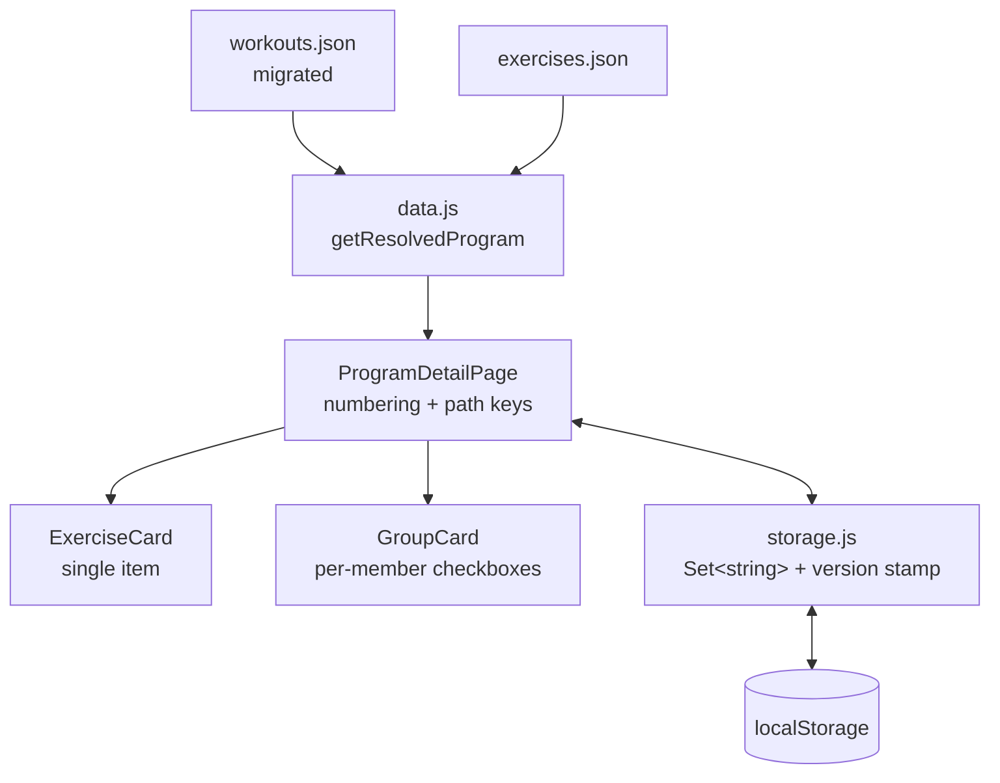
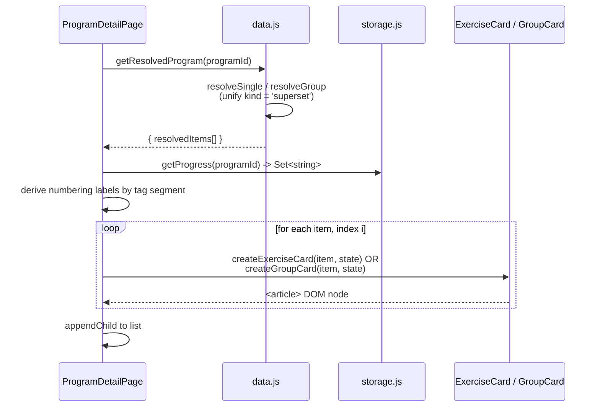
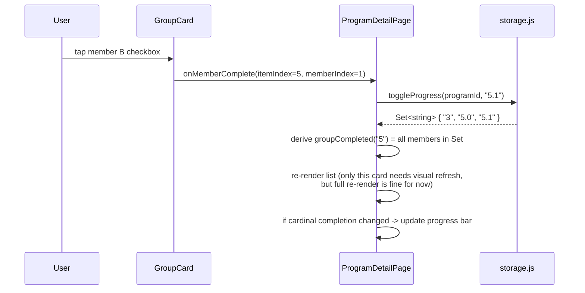
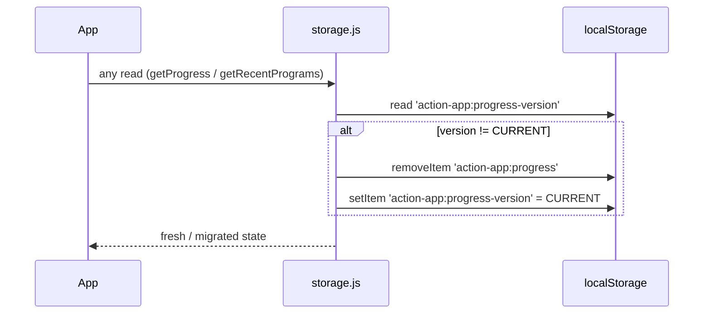

# Design Document: Superset Simplification

## Overview

This change simplifies how grouped exercises ("supersets") are represented in `workouts.json` and how they render in the v2 app. Today, three group kinds (`superset`, `compound`, `circuit`) coexist even though only `superset` and `compound` appear in the data and they render identically. Item display names embed positional prefixes (`"Exercise 2: ..."`, `"Warm Up 3: ..."`) which the renderer is forced to respect. Group cards collapse all members into a single master checkbox, hiding meaningful per-member completion state.

The new model collapses all group kinds into a single `kind: "superset"`, strips positional prefixes from `displayName` (the renderer derives them from item position and tag segment instead), and synthesizes group titles from member exercise names. The render layer gives each superset member its own checkbox and own demo expand/collapse, with group completion as a derived state. Progress storage moves from numeric `Set<itemIndex>` to string path keys (`"5.0"`, `"5.1"`, `"3"`) with a one-time wipe gated by a schema version stamp.

The scope is intentionally narrow: data cleanup + rendering + storage. Round counters, per-set tap dots, and equal-set-count validation are explicitly deferred.

## Architecture



The flow stays the same shape it already has — load JSON, resolve, render, persist — but each box gets a focused change:

- `workouts.json` is rewritten once by a Node migration script (kept under `v2/scripts/`).
- `data.js` no longer cares about `compound`/`circuit`; it produces a uniform `superset` group and synthesizes `displayName` when missing.
- `ProgramDetailPage` computes a segmented numbering label per item and threads path-keyed completion through to cards.
- `GroupCard` drops its master checkbox and renders independent members.
- `storage.js` switches to string keys and wipes legacy data on version mismatch.

## Sequence Diagrams

### Resolve and render a program



### Toggle a superset member



### One-time storage wipe



## Components and Interfaces

### data.js — `getResolvedProgram(id)`

**Purpose**: Resolve `exerciseId` references and return a uniform list of items where every group is a `superset`.

**Interface (JSDoc-style; vanilla JS)**:

```js
/**
 * Resolved single item.
 * @typedef {Object} ResolvedSingle
 * @property {'single'} kind
 * @property {string} exerciseId
 * @property {Object|null} exercise          // canonical from exercises.json
 * @property {string} [reps]
 * @property {string} [sets]
 * @property {string} [repUnits]
 * @property {string} [note]
 * @property {string} displayName            // exercise name; no "Exercise N:" prefix
 * @property {string[]} tags                 // e.g., ['warmup'], ['stretch'], []
 */

/**
 * Resolved superset group. (Replaces compound/circuit.)
 * @typedef {Object} ResolvedSuperset
 * @property {'superset'} kind
 * @property {string} displayName            // synthesized if not provided
 * @property {string} [note]
 * @property {string[]} tags
 * @property {ResolvedMember[]} members      // renamed from `exercises` for clarity
 */

/**
 * @typedef {Object} ResolvedMember
 * @property {string} exerciseId
 * @property {Object|null} exercise
 * @property {string} [reps]
 * @property {string} [sets]
 * @property {string} [repUnits]
 * @property {string} [note]
 * @property {string} displayName
 */

/**
 * @returns {Promise<{ id, title, requirements?, resolvedItems: Array<ResolvedSingle|ResolvedSuperset> } | null>}
 */
async function getResolvedProgram(id) { /* ... */ }
```

**Responsibilities**:

- Treat any `item.kind` value (`'superset'`, legacy `'compound'`, legacy `'circuit'`) as `'superset'`. Already-migrated data only has `'superset'`, but the resolver stays defensive in case a stale file is loaded.
- Synthesize `displayName` for groups when the source omits it (which the migration does for every superset). Algorithm in `synthesizeGroupTitle` below.
- Preserve `tags` flow on items (pages need it for segmented numbering).
- Keep the `exercises` → `members` rename internal to the resolver. Source JSON still uses `exercises` because that's what it has on disk; the resolver remaps the field.

### ProgramDetailPage — numbering + path-keyed state

**Purpose**: Compute segmented numbering labels, render the list, route completion events to path keys.

**Interface (internal helpers)**:

```js
/**
 * Compute label like "Warm Up 1", "Stretch 1", "Exercise 7" per item.
 * Numbering is by ITEM (a superset counts as one).
 * @param {Array<ResolvedSingle|ResolvedSuperset>} items
 * @returns {string[]}                       // labels[i] aligned to items[i]
 */
function computeNumberingLabels(items) { /* ... */ }

/**
 * Path key for a given item / member position.
 *   single        -> "3"
 *   group member  -> "5.0", "5.1"
 */
function pathKey(itemIndex, memberIndex /* optional */) { /* ... */ }

/**
 * Derived: true iff every member of the group at itemIndex is in `completed`.
 */
function isGroupCompleted(group, itemIndex, completed) { /* ... */ }
```

**Responsibilities**:

- Translate clicks from cards into `toggleProgress(programId, key)` calls with string keys.
- Derive group completion from per-member keys; never store a separate group key.
- Compute progress denominator as the count of "leaf" toggleables: `Σ (group ? group.members.length : 1)`.
- Pass a `numberingLabel` to each card via `state`.

### GroupCard — per-member checkboxes

**Purpose**: Render a superset with each member independently checkable and independently expandable.

**Interface**:

```js
/**
 * @param {ResolvedSuperset} item
 * @param {{
 *   index: number,
 *   isExpanded: boolean,                    // group-level expansion (shows members at all)
 *   numberingLabel: string,                 // e.g. "Exercise 4"
 *   memberCompleted: Set<number>,           // member indices that are checked
 *   memberExpanded: Set<number>,            // member indices whose demo is open
 *   onToggle: (itemIndex) => void,          // expand/collapse the group
 *   onMemberToggle: (itemIndex, memberIndex) => void,   // expand/collapse member demo
 *   onMemberComplete: (itemIndex, memberIndex) => void  // tick/untick member checkbox
 * }} state
 * @returns {HTMLElement}
 */
function createGroupCard(item, state) { /* ... */ }
```

**Responsibilities**:

- Show the numbering label as a small eyebrow above the title.
- Render the synthesized group title.
- Render the `SUPERSET` pill (kind label) and any item-level tags.
- Show a divergence stripe (`"4 · 4 · 6 sets"`) iff member `sets` values differ.
- Render each member as a row labeled A, B, C, ... with:
  - its own checkbox on the right (A11y: `aria-label="Mark complete"` etc.),
  - its own caret to expand/collapse the demo + note,
  - sets/reps stats,
  - left-side bracket/connector via a `border-l` Tailwind utility on the member stack container.
- Show a derived progress chip near the title: `1/2 complete`, full check when all done.
- Apply opacity and strikethrough to the title only when ALL members are complete.

### ExerciseCard — minor

**Purpose**: Same as today, plus accept a numbering label.

**Interface change**: `state` now includes `numberingLabel: string`.

**Responsibilities**: Render the eyebrow numbering label above the existing title. Drop any inferred prefix logic (none exists today, but if any was added later it would conflict with the new model).

### storage.js — string path keys + schema version

**Interface**:

```js
const PROGRESS_KEY = 'action-app:progress';
const PROGRESS_VERSION_KEY = 'action-app:progress-version';
const PROGRESS_VERSION = 2;            // bump = wipe

/** @returns {Set<string>} */
function getProgress(programId) { /* ... */ }

/** @param {string} key e.g. "3" or "5.1" */
function toggleProgress(programId, key) { /* ... */ }

function resetProgress(programId) { /* ... */ }

/** Internal: ensures we're on PROGRESS_VERSION; on mismatch, wipes PROGRESS_KEY. */
function ensureProgressSchema() { /* ... */ }
```

**Responsibilities**:

- Run `ensureProgressSchema()` lazily on first read. Idempotent and cheap.
- Validate that keys passed in match `^\d+(?:\.\d+)?$` defensively (drop anything that doesn't to avoid stale junk in the JSON file from manual edits).
- Recent-programs storage (`action-app:recent-programs`) is unchanged.

## Data Models

### workouts.json — item shapes (post-migration)

**Single item**:

```json
{
  "exerciseId": "decline_pistols",
  "reps": "10",
  "sets": "3",
  "repUnits": "reps",
  "note": "Optional cue.",
  "displayName": "Decline Pistols",
  "tags": ["warmup"]
}
```

**Superset item**:

```json
{
  "kind": "superset",
  "exercises": [
    { "exerciseId": "dbrdls",      "reps": "10", "sets": "4", "repUnits": "reps" },
    { "exerciseId": "splitsquats", "reps": "12", "sets": "4", "repUnits": "reps", "note": "Controlled on the way down." }
  ]
}
```

**Validation rules**:

- `kind`, when present, MUST be `"superset"`. Legacy `compound` / `circuit` MUST NOT appear after migration.
- `displayName` on supersets is OPTIONAL. When omitted, the resolver synthesizes it.
- `displayName` on singles MUST NOT contain a positional prefix matching `^(Warm Up|Exercise|Strength|Stretch)\s*\d+\s*:?\s*` (case-insensitive, tolerating extra whitespace before the colon).
- Member-level `note` MUST NOT be the boilerplate `"Meant to be a Super Set."` (and any `note` whose remainder is empty after stripping that phrase MUST be removed entirely).
- `tags` is preserved as-is; numbering segments key off existing `'warmup'` and `'stretch'` tags.

### Resolved item shapes

See JSDoc typedefs above. Two key differences from current resolver:

- `kind: 'compound' | 'circuit'` is gone. All groups are `kind: 'superset'`.
- Group's member array is exposed as `members` (not `exercises`) in the resolved object, even though the JSON field stays `exercises`. Callers in components use `item.members`.

### Storage schema

**localStorage keys**:

| Key                              | Type / shape                                    | Notes                                  |
| -------------------------------- | ----------------------------------------------- | -------------------------------------- |
| `action-app:progress`            | `{ [programId: string]: string[] }`             | Path keys. Persisted as JSON arrays.   |
| `action-app:progress-version`    | `string` (numeric, e.g. `"2"`)                  | Bumped to wipe progress on next load.  |
| `action-app:recent-programs`     | `Array<{ id, visitedAt }>`                      | Unchanged.                             |

**Path key grammar**:

```
key      ::= itemIndex | itemIndex "." memberIndex
itemIndex ::= unsigned int (decimal, no leading zeros except "0")
memberIndex ::= unsigned int (decimal, no leading zeros except "0")
```

Singles use `"<i>"`. Members use `"<i>.<m>"`. There is no group-level key.

## Title Synthesis Algorithm

```pascal
ALGORITHM synthesizeGroupTitle(members)
INPUT: members — non-empty list of resolved members
OUTPUT: title — String

BEGIN
  names ← [m.displayName for m in members]   // already de-prefixed
  IF length(names) = 1 THEN
    RETURN names[0]
  ELSE IF length(names) = 2 THEN
    RETURN names[0] + " & " + names[1]
  ELSE
    head ← names[0..length(names)-2]
    last ← names[length(names)-1]
    RETURN join(head, ", ") + " & " + last
  END IF
END
```

**Preconditions**: `members` has at least one element; each member has a non-empty `displayName`.
**Postconditions**: Returned string is non-empty, never contains positional prefixes (because members don't), uses `&` between the last two names and `,` between earlier ones.

## Numbering Algorithm

```pascal
ALGORITHM computeNumberingLabels(items)
INPUT: items — resolved items (singles and supersets)
OUTPUT: labels — array of strings, length = length(items)

BEGIN
  counters ← { warmup: 0, stretch: 0, exercise: 0 }
  labels   ← []

  FOR each item IN items DO
    segment ← classifyItem(item)             // 'warmup' | 'stretch' | 'exercise'
    counters[segment] ← counters[segment] + 1
    n ← counters[segment]
    label ← segmentLabel(segment) + " " + n  // "Warm Up 3", "Stretch 1", "Exercise 7"
    labels.push(label)
  END FOR

  RETURN labels
END

ALGORITHM classifyItem(item)
INPUT: item — resolved single or superset
OUTPUT: 'warmup' | 'stretch' | 'exercise'

BEGIN
  tags ← item.tags OR []
  IF 'warmup'  IN tags THEN RETURN 'warmup'
  IF 'stretch' IN tags THEN RETURN 'stretch'
  RETURN 'exercise'
END
```

**Preconditions**: `items` is the resolver output (each has `tags: string[]`).
**Postconditions**: `labels.length === items.length`. Each label is non-empty. Numbering within a segment is contiguous and 1-based.

**Notes**:

- Groups inherit their `tags` from the JSON item (today most superset items have no tags, so they classify as `'exercise'` — which matches the current `"Exercise N:"` numbering encoded in display names).
- A group whose members carry mixed `warmup`/`stretch` tags still classifies by the GROUP's own tags; member tags are not consulted. This is intentional and matches the existing data.

## UI Behavior

### Group card layout (post-change)

```
┌──────────────────────────────────────────────────────┐
│ Exercise 4                          [SUPERSET]   ▾   │  <-- numbering eyebrow + kind pill + chevron
│ Chin-ups & Pull-overs                                │  <-- synthesized title
│ 4 · 6 sets             •  1 / 2 complete             │  <-- divergence stripe (only if differ) + progress chip
├──────────────────────────────────────────────────────┤
│ │  A  Chin-ups                    [10 · 4 sets]  ☐   │
│ │     [demo collapsed]                                │
│ │                                                    │
│ │  B  Pull-overs                  [12 · 6 sets]  ✅   │
│ │     [demo expanded]                                 │
│ │     <video carousel>                                │
│ │     "Squeeze at the top" (note)                     │
└──┴───────────────────────────────────────────────────┘
   ^ left bracket / connector via border-l on members stack
```

### Interaction rules

- **Group expand/collapse**: Tapping the group header toggles whether members are visible at all. This is the existing behavior, kept.
- **Member expand/collapse**: When the group is expanded, each member row has its own caret. Tapping it toggles ONLY that member's demo + note region. Other members are unaffected.
- **Member checkbox**: Tap toggles `toggleProgress(programId, "i.m")`. The group never has its own checkbox.
- **Group progress chip**: Reflects `count(checked members) / count(members)`. When `count === total`, render a full check icon and apply the same `opacity-60 line-through` styling to the group title that single items get when complete.
- **Auto-collapse on completion**: For singles, today's "auto-collapse on completion" stays. For supersets, members do NOT auto-collapse on member completion (the user often wants to compare/finish the next member with the demo still visible). The whole group does NOT auto-collapse either.
- **Numbering label position**: Rendered as a small uppercase eyebrow above the title, e.g. `text-[10px] uppercase tracking-[0.1em] text-slate-500`. Reuse the existing tag-badge styling family.
- **Divergence stripe**: Shown only when not all members share the same `sets` value. Format: members' `sets` joined by ` · ` followed by `" sets"`. Hidden when uniform to keep the card quiet.

### Per-page progress bar

`completed.size / total` where `total` now equals the count of leaf toggleables, not the count of items. A program with 5 singles and 1 superset of 2 members has `total = 7`. This makes the progress bar honest about how much work is left.

## Migration Script

A one-shot Node script lives at `v2/scripts/migrate-workouts.js`. It mutates `workouts.json` at repo root (cwd-relative) in place, after writing a backup at `workouts.json.bak`. ~30 programs is small enough that the script runs in milliseconds; the value of the script over manual edits is consistency and an auditable diff.

```pascal
ALGORITHM migrateWorkouts(json)
INPUT: json — parsed workouts.json
OUTPUT: migrated json (mutated)

BEGIN
  prefixRe ← /^(Warm Up|Exercise|Strength|Stretch)\s*\d+\s*:\s*/i

  FOR each program IN json.programs DO
    FOR each item IN (program.items OR []) DO
      IF item.kind IS PRESENT THEN
        // group: superset / compound -> superset
        item.kind ← 'superset'
        // drop the synthesized group displayName; resolver will generate
        DELETE item.displayName
        FOR each member IN item.exercises DO
          member.note ← cleanMemberNote(member.note)
          IF member.note = "" OR member.note = NULL THEN DELETE member.note
          // Members never had a displayName; leave them alone.
        END FOR
      ELSE
        // single
        IF item.displayName MATCHES prefixRe THEN
          item.displayName ← item.displayName.replace(prefixRe, "")
        END IF
      END IF
    END FOR
  END FOR

  RETURN json
END

ALGORITHM cleanMemberNote(note)
INPUT: note — String or null
OUTPUT: cleaned note (may be "")

BEGIN
  IF note IS NULL OR note = "" THEN RETURN ""
  cleaned ← note
                .replace(/\s*Meant to be a Super Set\.\s*/gi, " ")
                .replace(/\s+/g, " ")
                .trim()
  RETURN cleaned
END
```

**Preconditions**: `json.programs` exists and is an array. `workouts.json` is git-tracked (so the diff is reviewable).
**Postconditions**:

- No item has `kind` other than `"superset"`.
- No single's `displayName` matches the prefix regex.
- No member `note` contains the substring `"Meant to be a Super Set"`.
- A `workouts.json.bak` file exists in the repo root (gitignored or to be deleted post-commit — the script logs a reminder).

## Correctness Properties

### Property 1: Numbering coverage and uniqueness

For every program, `computeNumberingLabels(items).length === items.length`, and labels are unique within their segment (no two items classified into the same segment receive the same number).

### Property 2: Group completion is derived, never stored

Storage never holds a key for a group on its own. `isGroupCompleted(group, i, completed)` returns `true` iff `group.members.every((_, m) => completed.has(\`${i}.${m}\`))`.

### Property 3: Path key validity

Every key written to storage matches `^\d+(?:\.\d+)?$` and, at the time of writing, indexes a real item or member in the currently loaded program.

### Property 4: Migration idempotence

Running the migration script twice on the same `workouts.json` is a no-op on the second run (other than touching mtime). `migrateWorkouts(migrateWorkouts(json))` is structurally equal to `migrateWorkouts(json)`.

### Property 5: Title synthesis is pure

For supersets, `synthesizeGroupTitle(members)` depends only on member `displayName` values — never on prefix counters or program-level state. Same input, same output.

### Property 6: Schema wipe is one-shot

After `ensureProgressSchema()` runs once with a mismatched version, the version key is updated; subsequent reads do not wipe. The wipe never triggers more than once per version bump.

### Property 7: Leaf total equals checkable count

`total = items.reduce((n, it) => n + (it.kind === 'superset' ? it.members.length : 1), 0)` exactly equals the number of distinct `(itemIndex, memberIndex?)` checkboxes the user can interact with on the page.

## Edge Cases

- **Unknown `exerciseId` in a member**: Resolver returns the member with `exercise: null` and `displayName: exerciseId` (the raw id). Synthesizer uses that id in the title (e.g., `"Chin-ups & unknown_pulls"`). The member still renders, still has a checkbox, but the demo carousel slot is empty (existing behavior).
- **Superset with one resolved member**: `members.length === 1` is allowed (e.g., second `exerciseId` was removed without restructuring). `synthesizeGroupTitle` returns the lone name. The group still gets a `SUPERSET` pill and a (single) member row labeled `A`. Visually a bit odd but explicit; corrects via data fix, not code special-case.
- **Superset with zero members**: Defensive — resolver returns the group with `members: []`. `ProgramDetailPage` skips rendering empty groups (continue to next item). They also contribute 0 to the leaf-toggleable total.
- **Item with both a `kind` and an `exerciseId`**: Treat as a group (kind wins). This mirrors current resolver behavior.
- **Legacy `compound` / `circuit` value sneaks back in**: Resolver coerces to `'superset'`. UI never sees the legacy values.
- **Stored path key references an item that no longer exists** (program edited): Treat as benign. The renderer only consults `completed.has(key)`; missing items are harmless. We don't proactively GC stale keys — `resetProgress` exists for that.
- **Stored progress contains numeric entries** (legacy v1 data): The schema-version wipe handles this. After wipe, `getProgress` returns an empty Set.
- **Member checkbox tapped while group is collapsed**: Should not happen (no UI affords it), but defensively the handler is index-based and would still toggle correctly. The progress chip on the next render reflects it.
- **Tag absent on every item**: All items classify as `'exercise'`, so labels become `Exercise 1, Exercise 2, ...`. Acceptable.
- **Tags including both `warmup` and `stretch` on the same item**: First match wins (`warmup` checked before `stretch`). Existing data does not exhibit this, but the rule is defined.
- **Member `note` becomes empty after stripping the boilerplate**: Migration deletes the `note` property entirely (so the resolver doesn't fall through to `exercise?.recommendations?.note` with an empty string and accidentally keep it).
- **`workouts.json.bak` already exists**: Migration script overwrites it (pre-migration backup is the freshest "before" state).

## Error Handling

| Scenario                                            | Response                                                                                | Recovery                                                          |
| --------------------------------------------------- | --------------------------------------------------------------------------------------- | ----------------------------------------------------------------- |
| `workouts.json` fetch fails                         | Existing error UI ("Couldn't load program") — unchanged                                 | User retries; offline cache may still have previous version       |
| Migration script run on already-migrated file       | No-op (idempotent); script logs `"already migrated, no changes"`                        | None needed                                                       |
| `localStorage` unavailable (private mode)           | Reads return empty Set, writes silently no-op (existing pattern in `storage.js`)        | Progress just doesn't persist; UI still functions in-session      |
| Stored progress JSON is malformed                   | `JSON.parse` catches; treat as empty                                                    | Effectively a wipe; user re-checks items                          |
| Schema version key absent                           | Treat as version `0` → triggers wipe                                                    | Wipe is the expected first-load behavior                          |
| Group has zero members after resolution             | `ProgramDetailPage` skips rendering it; logs `console.warn(programId, itemIndex)`       | Author edits `workouts.json`                                      |

## Testing Strategy

### Unit (lightweight, in-place)

This codebase has no test runner installed. Don't add one as part of this work. Instead, the migration script gets a small self-test mode (`node v2/scripts/migrate-workouts.js --selftest`) that runs the migrator against a hard-coded fixture and asserts the output shape, exiting non-zero on regression. This gives a guard against accidental future regressions without committing to a full test framework.

Functions to cover via the self-test fixture:

- `migrateWorkouts` — covers prefix stripping, kind unification, member-note cleanup, idempotence (run twice, second is no-op).
- `synthesizeGroupTitle` (inline copy in test fixture or imported) — 1, 2, 3+ member cases.
- `cleanMemberNote` — boilerplate-only note becomes `""`; mixed note keeps the non-boilerplate part.

### Manual / visual smoke test

Use Playwright MCP after the changes are in place. Two programs cover the matrix:

1. A program containing a superset (e.g., `agility_lower_1-2` — has `Exercise 2: DB RDL & Split Squats`). Verify:
   - SUPERSET pill renders.
   - Title is `"DB RDL & Split Squats"` (or whatever members resolve to).
   - Per-member checkboxes work; group has no master checkbox.
   - `n / 2 complete` chip updates; full check appears when both done.
   - Member demos expand/collapse independently.
   - Bracket / connector line is visible to the left of the member stack.
   - Numbering eyebrow shows `"Exercise 2"`.
2. A program with only singles (e.g., a stretch-only or warmup-only routine). Verify:
   - Eyebrow labels segment correctly: `Warm Up 1`, `Warm Up 2`, ..., `Stretch 1`, etc.
   - Single item completion behavior is unchanged.
3. Storage:
   - With v1 data in `localStorage`, load any program once. After load, `localStorage.getItem('action-app:progress')` is empty/null and `'action-app:progress-version'` equals `"2"`.
   - Toggle a member; confirm the stored array contains `"2.1"` (or similar) — open DevTools Application panel.

## Performance Considerations

- Re-rendering the entire item list on every toggle is O(n) where n ≤ ~15 items. Acceptable; matches current behavior. No new perf concerns introduced.
- The migration script reads/writes a single ~few-hundred-KB JSON file; trivial.
- `computeNumberingLabels` is O(items) and runs once per program render.

## Security Considerations

No new attack surface. All user input is local-only (taps, no text). HTML injection is guarded by the existing `escapeHtml` helper, which we continue to use in both cards. No `dangerouslySetInnerHTML`-equivalent paths.

## Dependencies

No new dependencies. The migration script uses only Node built-ins (`fs`, `path`). Vite, Tailwind, and the existing utility helpers are unchanged.
