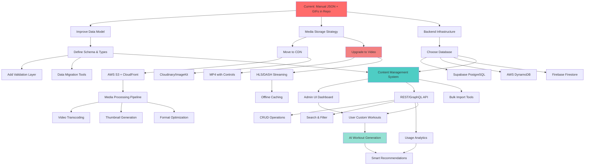
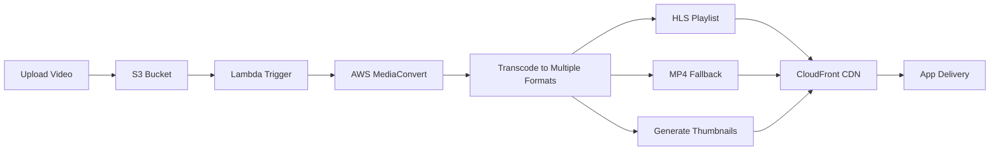

# Comprehensive Improvement Roadmap

## Overview

This document maps out all improvement opportunities across the entire application, with dependencies and decision points. It covers content management, data architecture, media handling, infrastructure, and user experience.

---

## Dependency Graph



---

## Current State: Content Onboarding

### How It Works Now (V1.0)

**YouTube → GIF Pipeline** (`youtube_to_gif_v2.py` + `run_gif_maker.sh`):
```bash
# 1. Edit run_gif_maker.sh with parameters
VIDEO_URL="https://www.youtube.com/shorts/kzc1LZbBtkI"
START_TIME=3
END_TIME=10
ASPECT_RATIO="3:4"
OUTPUT_FOLDER="gifs_staging"

# 2. Run script
./run_gif_maker.sh

# 3. Script automatically:
# - Downloads YouTube video (yt-dlp)
# - Extracts clip (start → end time)
# - Crops to aspect ratio (3:4 for mobile)
# - Converts to GIF (9 fps, moviepy)
# - Uses ChatGPT API to generate PascalCase name from video metadata
# - Saves to gifs_staging/

# 4. Manual steps:
mv gifs_staging/BicepCurls.gif gifs/
# Edit workouts.json manually
git add gifs/BicepCurls.gif workouts.json
git commit -m "Add Bicep Curls exercise"
git push
```

**Tools & Dependencies**:
- Python script: `youtube_to_gif_v2.py`
- Bash wrapper: `run_gif_maker.sh`
- Libraries: pytube, moviepy, yt-dlp, ffmpeg, PIL
- ChatGPT API: Auto-generates exercise names
- Manual: JSON editing, file movement, git commits

**Problems**:
- ❌ Requires editing shell script for each exercise (not user-friendly)
- ❌ No batch processing (one exercise at a time)
- ❌ Manual file movement from staging to production
- ❌ Manual JSON editing (error-prone, no validation)
- ❌ GIFs committed to git (bloats repo: 82 files, ~50MB)
- ❌ Requires Python setup (dependencies, API keys, ffmpeg)
- ❌ ChatGPT API costs money per exercise
- ❌ No preview before committing
- ❌ No rollback mechanism
- ❌ No versioning for content vs. code
- ❌ Requires git/JSON knowledge


- ❌ No collaboration workflow
- ❌ No content approval process
- ❌ Can't delegate to non-technical users

---

## Improvement Opportunities by Facet

### 1. Content Management System (CMS)

#### Current State
```json
// Manual editing of workouts.json
{
  "id": "agility_lower_1-1",
  "title": "Agility Lower Body Program 1.1",
  "requirements": "Dumbbells, Exercise Band",
  "exercises": [...]
}
```

#### Improvement Path

**Level 1: Local Tooling** (No backend required)
- CLI tool for adding exercises
- JSON schema validation
- Interactive prompts
- Auto-generate IDs
- Validate GIF paths exist

**Level 2: Admin UI** (Requires backend)
- Web-based dashboard
- Form-based exercise creation
- Drag-and-drop GIF upload
- Live preview
- Bulk import from CSV/Excel

**Level 3: Full CMS** (Advanced)
- Role-based access (admin, editor, viewer)
- Draft/publish workflow
- Version history
- Content approval process
- Collaboration features
- Search and filter
- Duplicate detection

#### Decision Points

**Q: Do we need multi-user collaboration?**
- No → Level 1 (CLI tool)
- Yes, but small team → Level 2 (Admin UI)
- Yes, large team → Level 3 (Full CMS)

**Q: Who creates content?**
- Just you → CLI tool is fine
- You + trainers → Need UI
- Community contributions → Need approval workflow

---

### 2. Data Model & Schema

#### Current State
```json
{
  "name": "Exercise Name",
  "gif": "gifs/Exercise.gif",
  "reps": "10",  // String, inconsistent
  "sets": "4",   // String, inconsistent
  "note": "...",
  "repUnits": "reps"
}
```

**Problems**:
- No TypeScript types
- Inconsistent data types (strings vs numbers)
- No validation
- No required fields enforcement
- No enum constraints
- Flat structure (no relationships)

#### Improvement Path

**Level 1: TypeScript Types**
```typescript
interface Exercise {
  id: string;
  name: string;
  mediaUrl: string;
  mediaType: 'gif' | 'video' | 'image';
  reps: number | string;  // Allow "AMRAP", "10-12"
  sets: number;
  repUnits: 'reps' | 'secs' | 'min' | 'yd';
  note?: string;
  rpe?: number;  // 1-10
  muscleGroups: MuscleGroup[];
  equipment: Equipment[];
  difficulty: 'beginner' | 'intermediate' | 'advanced';
  subExercise?: Exercise;
}

interface WorkoutProgram {
  id: string;
  title: string;
  description: string;
  requirements: Equipment[];
  category: Category;
  difficulty: Difficulty;
  duration: number;  // minutes
  exercises: Exercise[];
  tags: string[];
  createdAt: Date;
  updatedAt: Date;
  author?: string;
}
```

**Level 2: JSON Schema Validation**
```json
{
  "$schema": "http://json-schema.org/draft-07/schema#",
  "type": "object",
  "required": ["id", "name", "mediaUrl", "reps", "sets"],
  "properties": {
    "reps": {
      "oneOf": [
        { "type": "number", "minimum": 1 },
        { "type": "string", "pattern": "^\\d+-\\d+$|^AMRAP$" }
      ]
    }
  }
}
```

**Level 3: Database Schema**
```sql
-- PostgreSQL schema
CREATE TABLE exercises (
  id UUID PRIMARY KEY DEFAULT gen_random_uuid(),
  name TEXT NOT NULL,
  media_url TEXT NOT NULL,
  media_type TEXT CHECK (media_type IN ('gif', 'video', 'image')),
  reps TEXT NOT NULL,  -- Allow flexible formats
  sets INTEGER NOT NULL,
  rep_units TEXT CHECK (rep_units IN ('reps', 'secs', 'min', 'yd')),
  note TEXT,
  rpe INTEGER CHECK (rpe BETWEEN 1 AND 10),
  difficulty TEXT CHECK (difficulty IN ('beginner', 'intermediate', 'advanced')),
  created_at TIMESTAMP DEFAULT NOW(),
  updated_at TIMESTAMP DEFAULT NOW()
);

CREATE TABLE exercise_muscle_groups (
  exercise_id UUID REFERENCES exercises(id),
  muscle_group TEXT NOT NULL,
  PRIMARY KEY (exercise_id, muscle_group)
);

CREATE TABLE exercise_equipment (
  exercise_id UUID REFERENCES exercises(id),
  equipment TEXT NOT NULL,
  PRIMARY KEY (exercise_id, equipment)
);

CREATE TABLE workout_programs (
  id UUID PRIMARY KEY DEFAULT gen_random_uuid(),
  title TEXT NOT NULL,
  description TEXT,
  category TEXT NOT NULL,
  difficulty TEXT,
  duration INTEGER,  -- minutes
  created_at TIMESTAMP DEFAULT NOW(),
  updated_at TIMESTAMP DEFAULT NOW(),
  author_id UUID REFERENCES users(id)
);

CREATE TABLE program_exercises (
  id UUID PRIMARY KEY DEFAULT gen_random_uuid(),
  program_id UUID REFERENCES workout_programs(id) ON DELETE CASCADE,
  exercise_id UUID REFERENCES exercises(id),
  order_index INTEGER NOT NULL,
  parent_exercise_id UUID REFERENCES program_exercises(id),  -- For sub-exercises
  UNIQUE (program_id, order_index)
);
```

#### Decision Points

**Q: Do we need relational data?**
- No → Stick with JSON, add TypeScript types
- Yes, simple → JSON with references
- Yes, complex → Full database schema

**Q: Do we need to query/filter exercises?**
- No → JSON is fine
- Yes, basic → Add search index
- Yes, advanced → Database with full-text search

---

### 3. Media Storage & Delivery

#### Current State
- 82 GIF files in `/gifs/` directory
- Committed to git repo (~50MB)
- Served directly from GitHub Pages
- No optimization
- No caching strategy
- No responsive images
- No video support

**Problems**:
- ❌ Bloats git repo
- ❌ Slow git operations
- ❌ No CDN benefits
- ❌ GIFs are large (poor mobile experience)
- ❌ No video controls (pause, speed, scrub)
- ❌ No quality options
- ❌ No offline caching

#### Improvement Path

**Level 1: Move to CDN** (Keep GIFs)

**Option A: AWS S3 + CloudFront**
```
Workflow:
1. Upload GIFs to S3 bucket
2. Configure CloudFront distribution
3. Update JSON to use CDN URLs
4. Remove GIFs from git repo

Benefits:
- Fast global delivery
- Reduced repo size
- Versioning support
- Automatic backups
- Cost: ~$1-5/month

Considerations:
- Need AWS account
- Configure CORS
- Manage access keys
- Set up CI/CD for uploads
```

**Option B: Cloudinary / ImageKit**
```
Workflow:
1. Sign up for Cloudinary
2. Upload GIFs via API
3. Get optimized URLs
4. Automatic format conversion

Benefits:
- Automatic optimization
- Responsive images
- Format conversion (GIF → WebP/MP4)
- Transformation API
- Free tier: 25GB storage, 25GB bandwidth

Considerations:
- Third-party dependency
- Vendor lock-in
- API rate limits
```

**Level 2: Upgrade to Video** (Better UX)

**Why Video > GIF?**
- Smaller file size (MP4 is 50-80% smaller than GIF)
- Playback controls (pause, speed, scrub)
- Better quality
- Accessibility (captions, audio descriptions)
- Responsive quality (adaptive bitrate)

**Option A: Simple MP4**
```html
<video controls loop muted playsinline>
  <source src="https://cdn.example.com/exercises/squat.mp4" type="video/mp4">
  <source src="https://cdn.example.com/exercises/squat.webm" type="video/webm">
</video>
```

**Option B: HLS/DASH Streaming** (Advanced)
```
Benefits:
- Adaptive bitrate (quality adjusts to connection)
- Faster start time
- Better mobile experience
- Industry standard

Tools:
- AWS MediaConvert (transcoding)
- AWS CloudFront (delivery)
- Video.js or Plyr (player)

Cost:
- Transcoding: ~$0.015/min
- Storage: ~$0.023/GB/month
- Delivery: ~$0.085/GB
```

**Level 3: Media Processing Pipeline**


#### Decision Points

**Q: What's the priority?**
- Reduce repo size → Move to S3/Cloudinary (Level 1)
- Better UX → Upgrade to video (Level 2)
- Scale to thousands of videos → Processing pipeline (Level 3)

**Q: What's the budget?**
- Free → Cloudinary free tier
- Low ($5-20/month) → S3 + CloudFront
- Medium ($50-200/month) → Full pipeline with transcoding

**Q: What's the technical complexity tolerance?**
- Low → Cloudinary (managed service)
- Medium → S3 + CloudFront (DIY)
- High → Full AWS pipeline (MediaConvert, Lambda, etc.)

---

### 4. API & Ingress Methods

#### Current State
- No API
- Direct JSON file editing
- No programmatic access
- No validation layer

#### Improvement Path

**Level 1: REST API** (CRUD Operations)
```typescript
// Express.js example
POST   /api/exercises          // Create exercise
GET    /api/exercises          // List exercises
GET    /api/exercises/:id      // Get exercise
PUT    /api/exercises/:id      // Update exercise
DELETE /api/exercises/:id      // Delete exercise

POST   /api/programs           // Create program
GET    /api/programs           // List programs
GET    /api/programs/:id       // Get program
PUT    /api/programs/:id       // Update program
DELETE /api/programs/:id       // Delete program

POST   /api/media/upload       // Upload media file
```

**Level 2: GraphQL API** (Flexible Queries)
```graphql
type Exercise {
  id: ID!
  name: String!
  mediaUrl: String!
  mediaType: MediaType!
  reps: String!
  sets: Int!
  repUnits: RepUnit!
  note: String
  muscleGroups: [MuscleGroup!]!
  equipment: [Equipment!]!
  difficulty: Difficulty!
}

type Query {
  exercises(
    filter: ExerciseFilter
    sort: ExerciseSort
    limit: Int
    offset: Int
  ): [Exercise!]!
  
  exercise(id: ID!): Exercise
  
  programs(
    category: Category
    difficulty: Difficulty
  ): [WorkoutProgram!]!
}

type Mutation {
  createExercise(input: CreateExerciseInput!): Exercise!
  updateExercise(id: ID!, input: UpdateExerciseInput!): Exercise!
  deleteExercise(id: ID!): Boolean!
}
```

**Level 3: Batch Operations & Webhooks**
```typescript
// Bulk import
POST /api/exercises/bulk
Content-Type: application/json
{
  "exercises": [
    { "name": "...", "reps": 10, ... },
    { "name": "...", "reps": 12, ... }
  ]
}

// Webhook for external integrations
POST /api/webhooks/exercise-created
{
  "event": "exercise.created",
  "data": { ... }
}
```

#### Why You'd Want an API

**Use Cases**:
1. **Admin Dashboard**: CRUD operations without editing JSON
2. **Mobile App**: Native iOS/Android apps
3. **Third-Party Integrations**: Fitness trackers, wearables
4. **Automation**: Bulk imports, scheduled updates
5. **User-Generated Content**: Let users create custom workouts
6. **AI Integration**: LLM generates workouts via API
7. **Analytics**: Track usage, popular exercises
8. **A/B Testing**: Serve different content to different users

**Benefits**:
- Validation layer (prevent bad data)
- Authentication & authorization
- Rate limiting
- Versioning (v1, v2 APIs)
- Monitoring & logging
- Caching layer

#### Decision Points

**Q: Who needs programmatic access?**
- Just you → No API needed (CLI tool is fine)
- You + team → REST API
- External developers → Public API with docs

**Q: What's the query complexity?**
- Simple CRUD → REST API
- Complex filtering → GraphQL
- Real-time updates → GraphQL subscriptions

---

### 5. Backend Infrastructure

#### Current State
- No backend
- Static site only
- GitHub Pages hosting

#### Improvement Path

**Option A: Serverless (AWS)**
```
Architecture:
- API Gateway → Lambda functions
- DynamoDB for data
- S3 for media
- CloudFront for CDN
- Cognito for auth (optional)

Pros:
- Pay per use
- Auto-scaling
- No server management
- Leverage your AWS expertise

Cons:
- Cold starts
- Vendor lock-in
- Complex debugging
- Learning curve

Cost:
- Free tier: 1M requests/month
- Paid: ~$10-50/month for moderate traffic
```

**Option B: Supabase (Managed Backend)**
```
Architecture:
- PostgreSQL database
- Auto-generated REST API
- Real-time subscriptions
- Built-in auth
- Storage for media

Pros:
- Fast setup (minutes)
- Great DX
- Real-time out of box
- Open source (can self-host)

Cons:
- Less control
- Vendor lock-in (if not self-hosted)

Cost:
- Free tier: 500MB DB, 1GB storage, 2GB bandwidth
- Pro: $25/month (8GB DB, 100GB storage, 250GB bandwidth)
```

**Option C: Traditional Server (Railway/Fly.io)**
```
Architecture:
- Node.js/Python backend
- PostgreSQL database
- Docker container
- Deploy to Railway/Fly.io

Pros:
- Full control
- Familiar stack
- Easy local development

Cons:
- Server management
- Scaling complexity
- Higher baseline cost

Cost:
- Railway: ~$5-20/month
- Fly.io: ~$10-30/month
```

#### Decision Points

**Q: What's your AWS comfort level?**
- High → Go serverless (Lambda + DynamoDB)
- Medium → Supabase (easier, still scalable)
- Low → Railway/Fly.io (traditional server)

**Q: What's the expected scale?**
- <1K users → Any option works
- 1K-10K users → Serverless or Supabase
- >10K users → Serverless with caching

---

### 6. User Experience Improvements

#### Current State
- No user accounts
- No personalization
- No workout history
- No progress tracking over time

#### Improvement Path

**Level 1: Enhanced localStorage**
- Weight tracking per exercise
- Workout history (last 30 days)
- Export/import functionality
- Personal records (PRs)

**Level 2: User Accounts (Optional)**
- Email/password or social login
- Cloud sync across devices
- Workout history (unlimited)
- Custom workout creation
- Saved favorites

**Level 3: Social Features**
- Share custom workouts
- Follow other users
- Leaderboards
- Workout challenges
- Community programs

**Level 4: AI-Powered**
- Conversational workout builder
- Smart recommendations
- Progressive overload suggestions
- Form analysis (computer vision)
- Voice-guided workouts

---

## Recommended Implementation Sequence

### Phase 1: Foundation (V1.1) - 2-4 weeks
**Goal**: Improve content management without backend

1. ✅ **Add TypeScript types** for data model
2. ✅ **Create CLI tool** for adding exercises
3. ✅ **Add JSON schema validation**
4. ✅ **Move GIFs to Cloudinary** (free tier)
5. ✅ **Update JSON** to use CDN URLs
6. ✅ **Remove GIFs from repo**

**Benefits**:
- Cleaner repo
- Faster git operations
- Better DX for adding content
- Type safety

**No backend required**

---

### Phase 2: Backend MVP (V1.5) - 4-6 weeks
**Goal**: Add backend for user features

1. ✅ **Choose backend**: Supabase (recommended)
2. ✅ **Define database schema**
3. ✅ **Migrate JSON data** to database
4. ✅ **Build REST API** (auto-generated by Supabase)
5. ✅ **Add user accounts** (optional)
6. ✅ **Implement weight tracking**
7. ✅ **Add workout history**

**Benefits**:
- Multi-device sync
- Workout history
- Weight tracking
- Data safety

---

### Phase 3: Content Management (V2.0) - 6-8 weeks
**Goal**: Admin UI for content management

1. ✅ **Build admin dashboard**
2. ✅ **Form-based exercise creation**
3. ✅ **Drag-and-drop media upload**
4. ✅ **Live preview**
5. ✅ **Bulk import tools**
6. ✅ **Search and filter**

**Benefits**:
- Non-technical users can add content
- Faster content creation
- Preview before publish
- Collaboration

---

### Phase 4: Media Upgrade (V2.5) - 8-12 weeks
**Goal**: Upgrade to video with better UX

1. ✅ **Convert GIFs to MP4**
2. ✅ **Add video player** (Video.js or Plyr)
3. ✅ **Implement playback controls**
4. ✅ **Add quality options**
5. ✅ **Set up media pipeline** (AWS MediaConvert)
6. ✅ **Generate thumbnails**
7. ✅ **Implement HLS streaming** (optional)

**Benefits**:
- Smaller file sizes
- Better UX (pause, speed, scrub)
- Responsive quality
- Professional feel

---

### Phase 5: AI Features (V3.0) - 12-16 weeks
**Goal**: AI-powered workout generation

1. ✅ **Integrate OpenAI/Claude API**
2. ✅ **Build conversational interface**
3. ✅ **Implement RAG** with exercise database
4. ✅ **Add smart recommendations**
5. ✅ **Progressive overload suggestions**
6. ✅ **Form analysis** (computer vision, optional)

**Benefits**:
- Personalized workouts
- Intelligent recommendations
- Competitive differentiation

---

## Decision Matrix

### Content Management

| Requirement | CLI Tool | Admin UI | Full CMS |
|-------------|----------|----------|----------|
| Solo developer | ✅ | ⚠️ | ❌ |
| Small team | ⚠️ | ✅ | ⚠️ |
| Large team | ❌ | ⚠️ | ✅ |
| Non-technical users | ❌ | ✅ | ✅ |
| Approval workflow | ❌ | ⚠️ | ✅ |
| Version history | ⚠️ | ✅ | ✅ |
| Cost | Free | Low | Medium |
| Complexity | Low | Medium | High |

### Media Storage

| Requirement | Git Repo | S3 | Cloudinary | Full Pipeline |
|-------------|----------|-----|------------|---------------|
| <100 files | ✅ | ✅ | ✅ | ❌ |
| 100-1000 files | ⚠️ | ✅ | ✅ | ⚠️ |
| >1000 files | ❌ | ⚠️ | ✅ | ✅ |
| Video support | ❌ | ✅ | ✅ | ✅ |
| Optimization | ❌ | ⚠️ | ✅ | ✅ |
| Streaming | ❌ | ⚠️ | ⚠️ | ✅ |
| Cost | Free | Low | Low-Med | Medium |
| Complexity | Low | Medium | Low | High |

### Backend

| Requirement | No Backend | Serverless | Supabase | Traditional |
|-------------|------------|------------|----------|-------------|
| Static site | ✅ | ❌ | ❌ | ❌ |
| User accounts | ❌ | ✅ | ✅ | ✅ |
| Real-time | ❌ | ⚠️ | ✅ | ⚠️ |
| Complex queries | ❌ | ⚠️ | ✅ | ✅ |
| AWS expertise | N/A | ✅ | ❌ | ⚠️ |
| Fast setup | ✅ | ❌ | ✅ | ⚠️ |
| Cost | Free | Low | Low-Med | Medium |
| Complexity | Low | High | Low | Medium |

---

## Key Takeaways

### Content Onboarding (Your Main Question)

**Current**: Manual JSON editing + GIFs in repo
**Problem**: Error-prone, bloats repo, requires technical knowledge

**Recommended Path**:
1. **Short-term** (1-2 weeks): CLI tool + Cloudinary
2. **Medium-term** (1-2 months): Admin UI + Supabase
3. **Long-term** (3-6 months): Full CMS + media pipeline

### Media Strategy

**Current**: GIFs in repo (~50MB, growing)
**Problem**: Bloats repo, no controls, poor mobile experience

**Recommended Path**:
1. **Immediate**: Move to Cloudinary (free tier, easy)
2. **Near-term**: Convert to MP4 with controls
3. **Long-term**: HLS streaming with AWS pipeline

### Data Architecture

**Current**: Flat JSON files, no validation
**Problem**: No types, no relationships, hard to query

**Recommended Path**:
1. **Immediate**: Add TypeScript types + JSON schema
2. **Near-term**: Migrate to PostgreSQL (Supabase)
3. **Long-term**: Add full-text search, analytics

### API Strategy

**Current**: No API
**Why you'd want one**: Admin UI, mobile apps, AI integration, user-generated content

**Recommended Path**:
1. **Near-term**: REST API (Supabase auto-generates)
2. **Long-term**: GraphQL for complex queries

---

**Next Steps**: Which phase interests you most? I can help implement any of these improvements following the 150-150-CR rule.
