# AI Program Builder — Improvement Roadmap

## Dependency Graph

```mermaid
graph TD
    %% === CORE UX ===
    1.1[1.1 Split Panel Layout]
    1.2[1.2 Rich Program Preview]
    1.3[1.3 Inline Edit from Preview]
    1.4[1.4 Drag to Reorder]
    1.5[1.5 Undo/Redo]
    1.6[1.6 Open in Studio Editor]
    1.7[1.7 Conversation Templates]

    1.1 --> 1.2
    1.2 --> 1.3
    1.2 --> 1.4
    1.2 --> 1.6
    1.2 --> 3.1
    1.1 --> 7.3

    %% === AI QUALITY ===
    2.1[2.1 Streaming Responses]
    2.2[2.2 Visible Tool Calls]
    2.3[2.3 Enhanced System Prompt]
    2.4[2.4 Program Analysis Tool]
    2.5[2.5 Suggest Alternatives]
    2.6[2.6 Context-Aware Suggestions]
    2.7[2.7 Freeform Paste Mode]
    2.8[2.8 Volume Tracking]

    2.3 --> 2.6
    2.3 --> 2.8
    2.4 --> 2.8

    %% === EXERCISE DATA ===
    3.1[3.1 Demo Thumbnails in Preview]
    3.2[3.2 YouTube Search Tool]
    3.3[3.3 Auto-fill Defaults]
    3.4[3.4 Muscle Group Mapping]
    3.5[3.5 Similar Exercise Suggestions]

    3.4 --> 3.5

    %% === PERSISTENCE ===
    4.1[4.1 Save/Resume Sessions]
    4.2[4.2 Session History List]
    4.3[4.3 Auto-save on Tool Call]
    4.4[4.4 Direct File Write]
    4.5[4.5 Import Existing Program]

    4.1 --> 4.2
    4.1 --> 4.3
    4.1 --> 4.5

    %% === PROVIDER & COST ===
    5.1[5.1 Provider Switcher]
    5.2[5.2 Token/Cost Counter]
    5.3[5.3 Budget Limit]
    5.4[5.4 Local LLM Fallback]
    5.5[5.5 Model Selector]

    5.1 --> 5.4
    5.1 --> 5.5
    5.2 --> 5.3

    %% === PRODUCTION ===
    6.1[6.1 API Proxy]
    6.2[6.2 Rate Limiting]
    6.3[6.3 Server-Managed Sessions]
    6.4[6.4 Feature Flag]
    6.5[6.5 Ship to Production]
    6.6[6.6 Analytics]

    6.1 --> 6.2
    6.1 --> 6.3
    6.1 --> 6.4
    6.1 --> 6.5
    6.5 --> 6.6

    %% === POLISH ===
    7.1[7.1 Loading Animation]
    7.2[7.2 Error Recovery UI]
    7.3[7.3 Mobile Layout]
    7.4[7.4 Keyboard Shortcuts]
    7.5[7.5 Shareable Text Export]
    7.6[7.6 Theme Toggle]

    %% === STYLING ===
    classDef core fill:#3b82f6,stroke:#1d4ed8,color:white
    classDef ai fill:#f59e0b,stroke:#d97706,color:white
    classDef data fill:#10b981,stroke:#059669,color:white
    classDef persist fill:#8b5cf6,stroke:#6d28d9,color:white
    classDef provider fill:#ec4899,stroke:#be185d,color:white
    classDef prod fill:#ef4444,stroke:#b91c1c,color:white
    classDef polish fill:#6b7280,stroke:#374151,color:white

    class 1.1,1.2,1.3,1.4,1.5,1.6,1.7 core
    class 2.1,2.2,2.3,2.4,2.5,2.6,2.7,2.8 ai
    class 3.1,3.2,3.3,3.4,3.5 data
    class 4.1,4.2,4.3,4.4,4.5 persist
    class 5.1,5.2,5.3,5.4,5.5 provider
    class 6.1,6.2,6.3,6.4,6.5,6.6 prod
    class 7.1,7.2,7.3,7.4,7.5,7.6 polish
```

## All Improvements (Detailed)

---

### 1. CORE UX (Blue)

**1.1 Split Panel Layout**
Replace the single-column layout with a side-by-side view: chat on the left, live program on the right. This makes it immediately clear that a program is being built as you talk.

**1.2 Rich Program Preview**
Show full exercise names (not just IDs), reps/sets formatted nicely, tag badges, and group indicators. The preview should look like a mini version of the ProgramDetailPage.

**1.3 Inline Edit from Preview**
Tap any exercise in the preview panel to edit its reps, sets, or notes directly — without going through the chat. For quick tweaks that don't need AI involvement.

**1.4 Drag to Reorder**
Let users drag exercises up/down in the preview panel to reorder them. Faster than typing "move exercise 3 to position 1" in chat.

**1.5 Undo/Redo**
Cmd+Z reverts the last tool action (add, remove, group). Maintains a stack of program states so you can backtrack without asking the AI to undo.

**1.6 Open in Studio Editor**
A button that transfers the current program state to the existing ProgramEditorPage. For when you want to switch from AI-assisted to manual editing mid-session.

**1.7 Conversation Templates**
Pre-built starter prompts like "Build me a push day", "Create a rehab lower body", "Design a 30-minute circuit". One tap starts the conversation with context already set.

---

### 2. AI QUALITY (Amber)

**2.1 Streaming Responses**
Show tokens as they arrive instead of waiting for the full response. Makes the AI feel responsive even on complex multi-tool-call turns. Uses OpenAI's streaming SSE endpoint.

**2.2 Visible Tool Calls**
When the AI searches exercises, show the actual search results it considered (not just "✓ Added X"). Helps users understand why the AI picked a particular exercise and builds trust.

**2.3 Enhanced System Prompt**
Add muscle group awareness, tempo notation (3-1-2-0), RPE guidance, equipment constraints, and session duration estimates. Makes the AI's suggestions more contextual and coach-like.

**2.4 Program Analysis Tool**
New tool the AI can call: analyzes the current program for muscle balance, total volume, missing warmup/cooldown, or progression issues. User can ask "Is my program balanced?" and get a structured answer.

**2.5 Suggest Alternatives**
When a user asks "what else could I do for hamstrings?", the AI searches and presents 3-5 options with brief descriptions rather than immediately adding one. Collaborative, not prescriptive.

**2.6 Context-Aware Suggestions**
After each exercise is added, the AI proactively notes what's missing: "Your program has good quad work but no hamstring exercises yet. Want me to add some?" Requires muscle group mapping in the prompt.

**2.7 Freeform Paste Mode**
Paste an entire workout from ChatGPT, a coach, or a PDF. The AI parses the whole block in one turn — matching exercises, creating new ones, setting reps/sets — instead of going exercise by exercise.

**2.8 Volume Tracking**
The AI tracks total sets per muscle group as the program builds. Can warn when volume is too high (overtraining risk) or too low (stimulus insufficient). Requires muscle group tagging + analysis tool.

---

### 3. EXERCISE MATCHING & DATA (Green)

**3.1 Demo Thumbnails in Preview**
Show a small thumbnail (from Cloudinary) next to each exercise in the preview panel. Visual confirmation you picked the right exercise, especially for similar-sounding movements.

**3.2 YouTube Search Tool**
A new tool the AI can call to search YouTube for exercise demo videos. When creating a new exercise, it auto-finds a relevant demo and attaches it. Needs a YouTube Data API key.

**3.3 Auto-fill Defaults**
When the AI adds an exercise from the library, automatically use its recommended reps/sets/units unless the user specified otherwise. Already partially works — make it more reliable.

**3.4 Muscle Group Mapping**
Enrich exercises.json with primary/secondary muscle groups (quads, hamstrings, glutes, etc.). Enables the AI to reason about balance and suggest complementary exercises.

**3.5 Similar Exercise Suggestions**
When a user says "something like split squats but easier", the AI can find exercises that target the same muscle groups. Requires muscle group mapping to work well.

---

### 4. PERSISTENCE & SESSION (Purple)

**4.1 Save/Resume Sessions**
Store the conversation history + program state in localStorage after every message. If you refresh or come back later, you can pick up where you left off instead of starting over.

**4.2 Session History List**
A list of previous sessions: "Lower Body Rehab (3 days ago)", "Push Day Draft (yesterday)". Tap to resume any session. Like chat history in ChatGPT.

**4.3 Auto-save on Tool Call**
Every time the AI executes a tool (adds exercise, sets metadata), immediately persist state. No data loss even if the browser crashes mid-conversation.

**4.4 Direct File Write (Vite Dev Middleware)**
Instead of export → copy → paste, a "Save" button that writes directly to exercises.json and workouts.json via a Vite dev server middleware endpoint. Local dev only — eliminates the manual paste step.

**4.5 Import Existing Program**
Load an existing program from workouts.json into the AI session for modification. "Load Agility Lower 1.1 and help me make a harder version." The AI sees the current program and can suggest changes.

---

### 5. PROVIDER & COST (Pink)

**5.1 Provider Switcher**
Dropdown to switch between OpenAI, Anthropic, Google, and Ollama. Same tool definitions work across all — only the API call format changes. Lets you compare quality and cost.

**5.2 Token/Cost Counter**
Show tokens used and estimated cost in a status bar: "↑ 1,200 tokens · ↓ 800 tokens · ~$0.03 this session". Helps users understand what they're spending and when to be more concise.

**5.3 Budget Limit**
Set a per-session spending cap (e.g., $0.50). When reached, the agent pauses and asks if you want to continue. Prevents runaway costs from long conversations.

**5.4 Local LLM Fallback (Ollama)**
When you're offline or don't want to spend money, fall back to a local model via Ollama. Quality is lower (7-8B models) but it's free and works without internet.

**5.5 Model Selector**
Within a provider, choose which model to use. GPT-4o-mini for normal work, GPT-4o for complex multi-step reasoning, o1 for planning. Different cost/quality tradeoffs for different tasks.

---

### 6. PRODUCTION & MULTI-USER (Red)

**6.1 API Proxy**
A Cloudflare Worker (or Vercel Edge Function) that holds your OpenAI API key server-side. Web users hit your proxy instead of OpenAI directly. Prevents key exposure. ~20 lines of code.

**6.2 Rate Limiting**
Limit requests per user (by IP or session) on the proxy. Prevents a single user from racking up your API bill. Essential before exposing to the public.

**6.3 Server-Managed Sessions (OpenAI Assistants API)**
Use OpenAI's Threads/Assistants API to manage conversation state server-side. Each user gets a thread. No database needed on your end — OpenAI stores history. Simplifies multi-device access.

**6.4 Feature Flag**
Gate the AI builder behind a flag (URL param, cookie, or user list). Roll out to friends/testers before the public. Lets you iterate without breaking things for everyone.

**6.5 Ship to Production**
Remove the `isLocal` gate on the AI builder route. Make it available on your live site. The culmination of all the production-readiness work (proxy, rate limit, flag).

**6.6 Analytics**
Track what users build, which exercises are popular, where they drop off, average session length. Informs future improvements. Requires production deployment first.

---

### 7. POLISH (Gray)

**7.1 Loading Animation**
Replace the static "..." with an animated typing indicator (three pulsing dots or a shimmer). Small change that makes waiting feel intentional rather than broken.

**7.2 Error Recovery UI**
When an API call fails, show a clear error message with a "Retry" button. Currently errors just append as a red message — a retry button is more actionable.

**7.3 Mobile Layout**
On narrow screens, stack chat and preview vertically. The program preview becomes a collapsible bottom sheet you can pull up to see the current state. Requires split panel layout first.

**7.4 Keyboard Shortcuts**
Enter to send (already done), Escape to clear input, Cmd+E to export, Cmd+K to open settings. Standard shortcuts for power users.

**7.5 Shareable Text Export**
Export the program as human-readable text (not JSON). For sharing with a training partner or coach who doesn't care about data formats. Like: "Lower Body Rebuild A — 1. Backward Treadmill Walk (5 min)..."

**7.6 Theme Toggle**
Light/dark mode switch for the chat. Low priority since the whole app is already dark, but some people prefer light mode for readability during actual workouts.

---

## Recommended Build Order

| Phase | Items | Why |
|-------|-------|-----|
| **Now** | 1.1, 2.1, 7.1 | Make it usable and feel fast |
| **Next** | 4.1, 2.7, 1.2 | Don't lose work, handle the paste use case |
| **Then** | 2.3, 2.4, 3.4 | Make the AI actually smart about fitness |
| **Production** | 6.1, 6.2, 6.5 | Ship it to users |
| **Growth** | 6.3, 4.5, 3.2, 6.6 | Multi-user, rich features, data |
