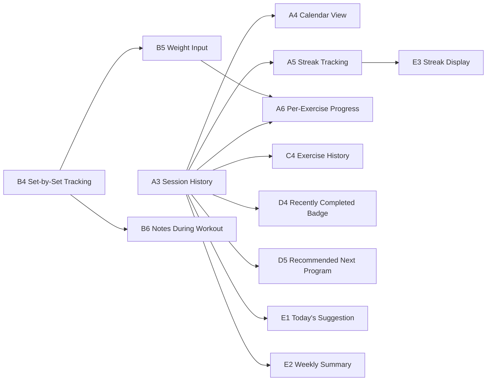
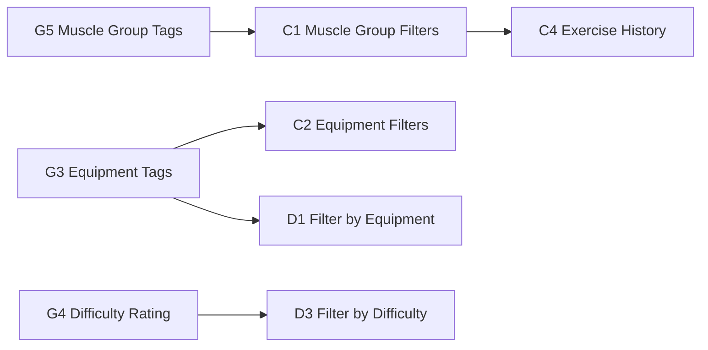
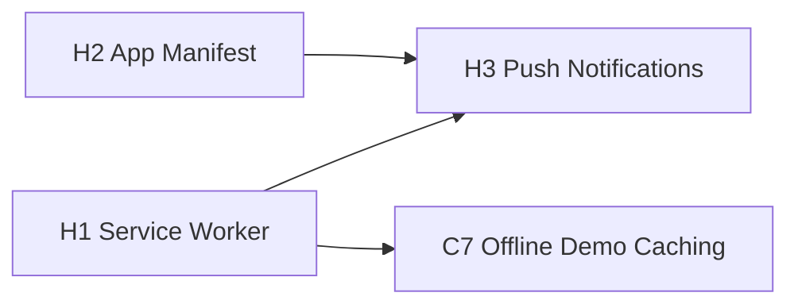
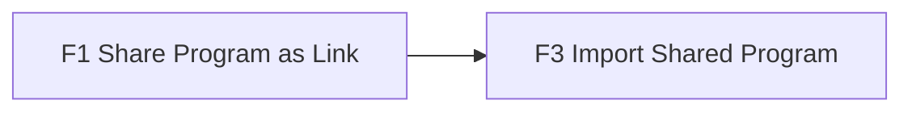
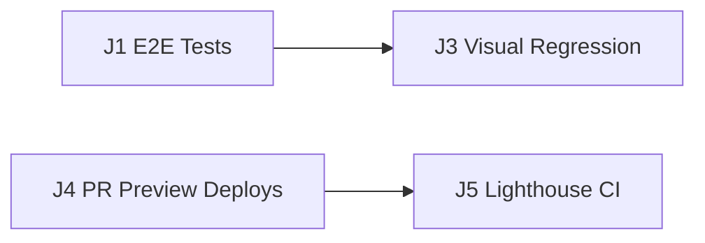
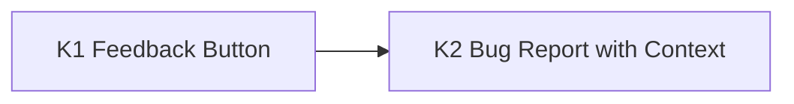

# Action App — Full Improvement Roadmap

(Excludes AI Program Builder — see AI-BUILDER-ROADMAP.md for that)

## Dependency Graphs

### Session History Tree (A3 is the key unlock)

### Data Enrichment Tree (G tags enable filters)

### PWA Tree (offline + installable)

### Social Tree

### Dev Experience Tree

### Feedback Tree

### Standalone Items (no dependencies)

```mermaid
graph LR
    A1[A1 Workout Timer]
    A2[A2 Rest Timer]
    A7[A7 Notes Per Session]
    A8[A8 Theme Toggle]
    B1[B1 Duration Estimate]
    B2[B2 Equipment Checklist]
    B3[B3 Section Headers]
    B7[B7 Next Program Suggestion]
    B8[B8 Print Export]
    C3[C3 Favorites]
    C5[C5 User Demos]
    C6[C6 Playback Speed]
    D2[D2 Filter by Duration]
    D6[D6 User Programs on Prod]
    E4[E4 Quick Resume]
    F2[F2 Progress Screenshot]
    F4[F4 Leaderboard]
    G1[G1 Missing Demos]
    G2[G2 More Programs]
    G6[G6 Inline Glossary]
    H4[H4 Prefetch Data]
    H5[H5 Lazy Loading]
    H6[H6 Bundle Optimization]
    I1[I1 Haptic Feedback]
    I2[I2 Voice Readout]
    I3[I3 Touch Targets]
    I4[I4 Screen Reader Audit]
    I5[I5 Reduce Motion]
    I6[I6 Landscape Mode]
    J2[J2 Unit Tests]
    J6[J6 Auto-format Hook]
    K3[K3 Feature Voting]
    K4[K4 Changelog]
    K5[K5 About Page]
```

## All Improvements (Detailed)

---

### A. USER EXPERIENCE (Blue) — Cross-cutting features that affect how users interact with the whole app

**A1 Workout Timer** — A global stopwatch that starts when you open a program and tracks how long your session takes. Shows elapsed time in the header. Useful for pacing and logging.

**A2 Rest Timer Between Sets** — After marking an exercise complete, optionally start a configurable rest countdown (30s, 60s, 90s). Vibrates/beeps when rest is over. Common in gym apps.

**A3 Session History / Log** — Record every time a user completes a program (date, duration, notes). Stored in localStorage. Foundation for streaks, calendar, and progress features.

**A4 Calendar View** — Visual calendar showing which days the user worked out. Colored dots for each day. Tapping a day shows what programs were completed. Requires session history.

**A5 Streak Tracking** — "You've worked out 5 days in a row 🔥". Motivational counter on the home page. Simple: count consecutive days with logged sessions.

**A6 Per-Exercise Progress History** — Track weight/reps over time for each exercise. "Last time you did DB Box Squats: 15 reps @ 10 lbs." Requires session history + weight input.

**A7 Notes Per Session** — After finishing a workout, add a free-text note: "Felt strong today", "Knee was tight on squats". Saved in session log.

**A8 Dark/Light Theme Toggle** — User preference for light mode. Some people work out in bright gyms and can't see a dark UI. Low priority since the current dark theme is clean.

---

### B. PROGRAM DETAIL PAGE (Amber) — Improvements to the workout execution experience at `/#/program/:id`

**B1 Estimated Session Duration** — Show "~35 min" at the top based on exercise count × average time per exercise (sets × 45s + rest). Helps users know what they're committing to.

**B2 Equipment Checklist** — Parse the `requirements` field into a tappable checklist: "☐ Dumbbells ☐ Bench ☐ Treadmill". Mark off what you have before starting.

**B3 Warm-up / Main / Cooldown Sections** — Visually separate exercises tagged `warmup`, untagged (main), and `stretch`. Add section headers with distinct styling. Data already has tags.

**B4 Set-by-Set Tracking** — Instead of marking an entire exercise done with one tap, track individual sets: "Set 1 ✓ Set 2 ✓ Set 3 ○". More granular progress.

**B5 Weight Input Per Exercise** — Text field to log the weight used. "DB Box Squat: [15] lbs". Saved per session. Enables progressive overload tracking over time.

**B6 Notes Input During Workout** — Quick note field per exercise during the session: "Felt too easy, go heavier next time." Context you'll want later.

**B7 Next Program Suggestion** — After completing a program, suggest what to do next. "You just did Lower Body. Tomorrow try Push Day?" Based on plans.json rotation logic.

**B8 Print / PDF Export** — Generate a clean printable version of the program. For people who prefer paper in the gym or want to share with a coach.

---

### C. EXERCISE LIBRARY (Green) — Improvements to the browse/search experience at `/#/exercises` and `/#/exercise/:id`

**C1 Muscle Group Filters** — Filter buttons: Quads, Hamstrings, Glutes, Chest, Back, etc. Tap to show only exercises targeting that muscle. Requires muscle group tagging on data.

**C2 Equipment Filters** — Filter by available equipment: "Show me exercises I can do with just dumbbells." Requires equipment tagging on exercises.

**C3 Favorites / Bookmarks** — Star exercises you use frequently. Shows a "Favorites" section at the top of the library. Stored in localStorage.

**C4 Exercise History** — On the exercise detail page, show "Last performed: 3 days ago in Agility Lower 1.1". Requires session history logging.

**C5 User-Submitted Demos** — Allow users to upload their own form videos as demos. Probably future/server-required. Could start with just "link a YouTube URL".

**C6 Video Playback Speed Control** — Slow down demos to 0.5x for studying form, or speed up to 2x for quick reference. Simple `playbackRate` property on video elements.

**C7 Offline Demo Caching** — Cache demo videos/images via service worker so they play without internet. Gym wifi is unreliable. Requires PWA service worker.

---

### D. PROGRAMS LIST / SEARCH (Cyan) — Improvements to `/#/programs` and `/#/search`

**D1 Filter by Equipment Available** — "I only have dumbbells and a band" → show only programs whose requirements match. Requires equipment tagging on exercises.

**D2 Filter by Duration** — "Show me programs under 30 minutes." Requires duration estimates on programs.

**D3 Filter by Difficulty** — Beginner / Intermediate / Advanced tags. Requires difficulty ratings on programs.

**D4 Recently Completed Badge** — Programs you did in the last week show a "✓ Done 2 days ago" badge. Motivates variety — nudges you toward programs you haven't done recently.

**D5 Recommended Next Program** — Based on what you've been doing, suggest what's next. "You've done 3 lower body sessions this week — try an upper body program?" Requires session history.

**D6 User-Created Programs Visible on Prod** — Programs created via Studio or AI Builder saved to localStorage and browsable alongside the built-in ones. No backend needed.

---

### E. HOME PAGE (Purple) — Improvements to the landing experience at `/#/`

**E1 Today's Workout Suggestion** — Based on session history and plan rotation, suggest what to do today: "It's been 2 days since your last session. Try Agility Lower 2.1?" One-tap to start.

**E2 Weekly Summary Card** — "This week: 3 sessions, 2.5 hours, 45 exercises completed." Quick stats card below the hero. Motivational at-a-glance.

**E3 Motivation Quote / Streak Display** — Show current streak prominently: "🔥 5 day streak!" or a rotating fitness quote. Lightweight dopamine hit when you open the app.

**E4 Quick Resume Button** — If you left a program mid-session (browser closed), show "Continue Agility Lower 1.1 (4/8 done)" as the first card. One tap to jump back in.

---

### F. SOCIAL / SHARING (Pink) — Ways to share and interact with others

**F1 Share Program as Link** — Generate a shareable URL that encodes the program (or an ID). Someone opens the link and sees the full program. Works with hash-based routing.

**F2 Share Progress Screenshot** — After completing a workout, generate a styled card image (canvas-based) with your stats: "Completed Agility Lower 1.1 — 8 exercises, 42 min 🔥". Share to Instagram/stories.

**F3 Import Shared Program** — When someone shares a link, the app imports that program into the user's library. "Juan shared Lower Body Rebuild A with you. [Add to library]"

**F4 Leaderboard / Challenges** — "Complete 5 workouts this week" challenges with friends. Far future — requires backend/auth. Fun but complex.

---

### G. DATA & CONTENT (Lime) — Enriching the exercise/program database

**G1 Add Demos to 13 Missing Exercises** — 13 exercises (mostly Reload PT) have zero demos. Find YouTube videos or record your own. Pure content work, no code needed.

**G2 More Programs** — Add Upper Body Rebuild, Core Stability, HIIT Circuit, Mobility Flow, etc. Use the AI builder or Studio. Grows the library for end users.

**G3 Equipment Tagging on Exercises** — Add an `equipment: ["dumbbells", "bench"]` field to each exercise. Enables equipment-based filtering everywhere.

**G4 Difficulty Rating on Programs** — Add `difficulty: "intermediate"` to each program in workouts.json. Enables difficulty filtering and appropriate suggestions.

**G5 Muscle Group Tagging on Exercises** — Add `muscles: { primary: ["quads"], secondary: ["glutes"] }` to each exercise. Enables balance analysis, filters, and smart suggestions.

**G6 Glossary Integrated Inline** — When a program note mentions "RPE" or "AMRAP", show a tooltip with the glossary definition. Already have glossary.json — just wire it into the exercise cards.

---

### H. PERFORMANCE & PWA (Orange) — Making the app fast, installable, and work offline

**H1 Service Worker** — Cache the app shell, exercise data, and demo media for offline use. Users can browse programs and follow workouts without internet (common in gyms).

**H2 App Manifest** — Add a `manifest.json` so users can "Add to Home Screen" on iOS/Android. The app launches full-screen like a native app. Quick win — just a JSON file + icons.

**H3 Push Notifications** — "Time for your workout! You haven't trained in 2 days." Requires service worker + user permission. Powerful for retention but invasive if overused.

**H4 Prefetch Program Data** — When the user is on the home page, prefetch the program they're most likely to tap next (based on recents). Eliminates loading spinner on navigation.

**H5 Image/Video Lazy Loading** — Only load demo media when scrolled into view. Already partially done (carousel is lazy) — ensure all images use `loading="lazy"` and IntersectionObserver.

**H6 Bundle Size Optimization** — Current bundle is 129KB (27KB gzipped). Good, but could be better with code splitting: load Studio/AI pages only when navigated to (dynamic import).

---

### I. ACCESSIBILITY & MOBILE (Teal) — Making the app usable for everyone on every device

**I1 Haptic Feedback on Completion** — Vibrate the phone briefly when marking an exercise complete. Subtle tactile confirmation. Uses `navigator.vibrate()` — one line of code.

**I2 Voice Readout of Exercise** — Tap a button to hear the exercise name and instructions read aloud (Web Speech API). Hands-free in the gym while holding weights.

**I3 Larger Touch Targets** — Audit all buttons for 44×44px minimum. Some icons (dots in carousel, small links) might be too small for sweaty fingers at the gym.

**I4 Screen Reader Audit** — Test with VoiceOver/TalkBack. Ensure all interactive elements have `aria-label`, all images have alt text, and focus order is logical.

**I5 Reduce Motion Option** — Respect `prefers-reduced-motion` media query. Disable slide-up animations, fade-ins, and celebration effects for users who get motion sick.

**I6 Landscape Mode Support** — The app is portrait-optimized. In landscape (tablet, rotated phone), the layout should adapt. Low priority but nice for iPad users.

---

### J. DEVELOPER EXPERIENCE (Gray) — Making the codebase easier to maintain and deploy safely

**J1 E2E Tests with Playwright** — Automated browser tests that navigate through the app: open program, complete exercises, check progress saves. Catches regressions before push.

**J2 Component Unit Tests** — Test individual functions: `tokenize()`, `scoreMatch()`, `getResolvedProgram()`. Fast, run in Node, catch logic bugs.

**J3 Visual Regression Tests** — Screenshot each page and compare against baselines. Catches unintended CSS changes. Requires E2E tests as foundation.

**J4 PR Preview Deployments** — Each PR gets a temporary URL to preview changes before merging. Useful when collaborating or reviewing on mobile.

**J5 Lighthouse CI Score Check** — Run Lighthouse in CI and fail the build if performance/accessibility scores drop below thresholds. Keeps quality high over time.

**J6 Auto-format on Commit (Husky)** — Pre-commit hook that runs Prettier + ESLint. Ensures consistent code style without thinking about it. Already have the tools — just need the hook.

---

### K. FEEDBACK & COMMUNICATION (Indigo) — Letting users talk to you

**K1 Feedback Button (Formspree)** — A floating "Feedback" button or footer link that opens a simple one-field form. Submits via Formspree (free, no backend) and emails you directly. Users don't need an account.

**K2 Bug Report with Context** — When submitting feedback, auto-attach the current page, browser info, and screen size. Helps you reproduce issues without asking follow-up questions.

**K3 Feature Request Voting** — A simple page listing planned features where users can upvote. Could be a link to a GitHub Discussions page or a Canny board (free tier). Helps prioritize what to build next.

**K4 In-App Changelog** — A "What's New" section or modal showing recent updates. Keeps users informed and shows the app is actively maintained. Can be a simple JSON file of entries.

**K5 Contact / About Page** — A `/#/about` page with your name, the project's story, links to GitHub, and a way to reach you. Builds trust and personality.

---

## Summary by Impact

| Priority | Items | Impact |
|----------|-------|--------|
| **High (do soon)** | A3, B3, G1, H2, B1 | Session logging unlocks 8 features. Section headers are free (data exists). Missing demos is a content gap. Manifest is 5 min of work. |
| **Medium (next quarter)** | A1, A2, B4, C1, G5, H1, D1 | Timer and set tracking make workouts interactive. Filters need data enrichment first. Offline is table stakes for gym apps. |
| **Low (someday)** | F2, F4, I2, H3, C5, A8 | Social features, voice, push notifications — nice but not essential for a personal fitness app. |
